```{r, include = FALSE}
knitr::opts_chunk$set(
  collapse = TRUE,
  comment = "#>"
)
```
<style>
  body {
    text-align: justify;
  }
  
  .col2 {
    columns: 2 200px;         /* number of columns and width in pixels */
    -webkit-columns: 2 200px; /* chrome, safari */
    -moz-columns: 2 200px;    /* firefox */
  }
  
  .leg {
    font-size: 12px;
  }

  img {
    display: block;
    margin-left: auto;
    margin-right: auto;
    max-width: 100%;
    height: auto;
  }

  .figure {
    text-align: center;
    margin: 20px 0;
  }

  .figure img {
    display: inline-block;
    vertical-align: middle;
  }

  .figure figcaption {
    font-size: 12px;
    text-align: center;
  }
</style>
* [Introduction](#introduction)
  + [Getting started](#getting-started)
  + [The concept of energy balance](#the-concept-of-energy-balance)
  + [A very simple microclimate model](#a-very-simple-microclimate-model)
* [Above canopy](#above-canopy)
  + [Radiation and albedo](#radiation-and-albedo)
  + [Sensible heat and wind](#sensible-heat-and-wind)
  + [Latent heat and stomatal conductance](#latent-heat-and-stomatal-conductance)
  + [A more complex microclimate model](#a-more-complex-microclimate-model)
* [Below canopy](#Below canopy)
  + [Two-stream radiation models](#two-stream-radiation-models)
  + [Longwave radiation](#longwave-radiation)
  + [Wind speed](#wind-speed)
  + [Leaf temperature](#leaf-temperature)
  + [Air temperature and humidity](#air-temperature-and-humidity)
* [Ground heat storage](#ground-heat-storage)
  + [Simple estimates](#simple-estimates)
  + [Soil temperature model](#soil-temperature-model)
  + [Soil water model](#soil-water-model)
* [Snow](#snow)   
  + [Snow energy balance](#snow-energy-balance)
  + [Snow mass balance](#snow-mass-balance)
  + [Canopy snow interception](#canopy-snow-interception)
* [Animal energy budgets](#animal-energy-budgets)  
  + [Radiation absorption](#radiation-absorption)
  + [Resistance to heat loss](#resistance-to-heat-loss)
  + [Metabolic rates](#metabolic-rates)
  + [Ectotherms](#ectotherms)
  + [Endotherms](#endotherms)
* [Microclimate models](#microclimate-models)
  + [micropoint](#micropoint)
  + [microclimf](#microclimf)
  + [mesoclim](#mesoclim)
  + [microclimdata and mcera5](#microclimdata-and-mcera5)
  + [NicheMapR](#nichemapr)
  + [TrenchR](#trenchr)
* [References](#references)

## Introduction
This vignette provides an introduction to mechanistic (process-based) microclimate modelling, with the basic concepts covered in progressively greater detail as you work through it. The package includes a set of R functions for calculating different components of microclimate, each of which is described in turn. At times, it may be useful to inspect the R code inside these functions, which can be done simply by typing the function name into the console. The functions are also extensively commented in the source code so you may wish also to inspect the functions on GitHub (e.g. by browsing the repository or cloning it locally), as comments are not shown when printing functions in R.

Some components of microclimate are tightly coupled. For example, surface temperature depends on the sensible heat flux, while the sensible heat flux itself depends on surface temperature. Resolving these feedbacks typically requires iteration, which can become slow when applied across long time series.

The vignette concludes with a section introducing a set of microclimate modelling packages aimed at ecologists, including micropoint, microclimf, and NicheMapR, and outlining what each is designed to do (and not do). All three rely on underlying compiled code (C++ or Fortran) to run these calculations efficiently. micropoint is particularly closely aligned with microclimlearn, mirroring its structure and calculations but implemented in C++ for improved performance. microclimf is designed for applying similar methods across landscapes to generate gridded outputs. NicheMapR, by contrast, is a point-based biophysical modelling framework built around a Fortran core, linking microclimate to organism heat and water balance, but it does not explicitly resolve below-canopy microclimate in the way the approaches developed here are intended to.

### Getting started
Install both packages from Github and load them as follows

```{r eval=FALSE}
require(devtools) # Install from CRAN if not already installed
devtools::install_github("ilyamaclean/microclimlearn")
devtools::install_github("ilyamaclean/micropoint")
library(microclimlearn)
library(micropoint)
```

The 'micropoint' package, once loaded, provides access to a few built-in datasets useful for running microclimate models, including a dataset of macroclimate weather variables and lists of ground and vegetation parameters. These will be described in more detail later.

### The concept of energy balance
The conceptual starting point for modelling microclimate is the law of energy conservation. Organisms and other opaque objects absorb shortwave solar radiation and longwave (thermal) radiation from the sky and surrounding surfaces, while emitting their own thermal radiation. They exchange sensible heat with the air and latent heat through vapour exchange (e.g. evapotranspirative cooling). When the net energy balance is positive, the object warms; when negative, it cools.

For small objects such as plant leaves, and over short periods (e.g. an hour), heat storage is negligible and fluxes reach a steady state. For larger objects, however, heat storage must be included to account for gains and losses through time. The same applies when modelling environmental temperatures, where heat storage by the ground is significant. Rather than treating temperature as a fully transient process, it is often more practical to include a term for the rate of heat storage or release. Within this framework, the temperature of a vegetated surface is that which balances the energy budget: when net radiation is positive, the surface warms, increasing sensible and latent heat losses until equilibrium is reached.

When modelling the microclimate of an environment, the surface undergoing energy exchange is generally represented by a single, homogeneous layer of vegetation. The energy balance of this surface layer is then solved to determine the equilibrium surface temperature, which in turn influences the temperature of the air above or within the canopy. The relevant inputs to an environmental microclimate model are macroclimate variables and a set of parameters describing the physical and radiative properties of the surface. For modelling the energy budget of an organism, the inputs instead comprise the local microclimate surrounding the organism and parameters describing its geometry, optical traits, and thermal properties. In both cases, the same physical principles apply.

In reality, vegetation is seldom homogeneous. Leaf area, canopy height, and optical properties vary both vertically and horizontally, creating spatial gradients in light, humidity, and temperature. These complexities are addressed in more detail below, where we extend the framework to describe energy exchange and microclimate variation beneath the canopy.

In the next section we illustrate how the energy balance can be solved by creating our own very simple microclimate model from first principles.

### A very simple microclimate model
The main function used in this example is SolveEnergyBalance, which forms the core of the simple microclimate model. We apply it to the built-in climate dataset provided with the micropoint package, but first we need to calculate several input variables. The most important of these is Rabs, the flux density of radiation absorbed by the canopy. This represents the sum of absorbed shortwave and longwave radiation.

To calculate absorbed shortwave radiation, we must specify an albedo — the fraction of incoming solar radiation that is reflected by the surface and therefore not absorbed. In the example below, albedo is held constant at 0.23. For longwave radiation, we specify an emissivity, which in this context can be interpreted as an absorption coefficient; this term is defined more precisely later in the vignette. We specify a value of 0.97, which is typical of vegetation. Conventionally emissivity is specified rather than reflectance as for longwave radiation it is also a measure of how efficiently radiation is emitted relative to an ideal black body. We return to this later.  

```{r eval=FALSE}
# Calculate absorbed radiation
alb <- 0.23 # albedo
em <- 0.97  # emissivity
Rabs_sw <- (1 - alb) * climdata$swdown
Rabs_lw <- em * climdata$lwdown
Rabs <- Rabs_sw + Rabs_lw

# Plot through time
tme <- as.POSIXct(climdata$obs_time, tz = "UTC")
plot(Rabs ~ tme, type = "l",
     xlab = "Month",
     ylab = expression("Absorbed radiation (W " * m^-2 * ")"))
```
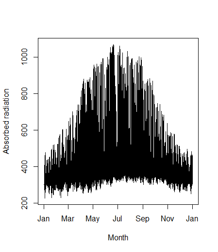

The next input we need to calculate is the bulk surface aerodynamic resistance to heat loss, a coefficient that determines how readily heat is transferred from the surface to the air. It decreases with increasing wind speed but also depends on the shape of the vertical wind-speed profile. To describe this profile, we must first calculate two key parameters: the zero-plane displacement height (the height above the ground at which wind flow effectively interacts with a vegetation canopy) and the roughness length for momentum, a surface property that controls how wind velocity changes with height. In addition, we calculate the roughness length for heat, which is related to the momentum roughness but specifically governs heat transfer. These terms are explained in more detail in the Sensible Heat section below; in essence, the first two describe the wind profile’s shape, while the third determines how efficiently heat is lost from the surface. All three tend to show a very consistent relationship with vegetation height. Below we use a simplified approach. A more comprehensive treatment is detailed in the Sensible Heat section

```{r eval=FALSE}
# Calculate resistance to heat loss
zref <- 2        # height above ground of weather data (m)
veghgt <- 0.12   # vegetation height (m)
ka <- 0.41       # von Kármán constant
d <- 0.65 * veghgt  # zero-plane displacement height (m)
zm <- 0.1 * veghgt  # roughness length for momentum (m)
zh <- 0.2 * zm      # roughness length for heat (m)

u2 <- climdata$windspeed
u2[u2 < 0.5] <- 0.5 # minimum wind speed (m s-1)

rHa <- (log((zref - d) / zm) * log((zref - d) / zh)) /
       (ka^2 * u2)  # resistance to heat loss
```

One point to note is that the line of code that computes `rHa` makes the assumption that macroclimate data provided as an input is above canopy (it is not possible to compute the log of a negative value). Most weather stations are located 1-2m above ground so this assumption will be violated for forest vegetation. The issue is quite hard to deal with and involves making some assumptions the nature of the surface in which a weather station is located and then computing the the vertical profiles in temperature, humidity, pressure and wind to derive expected values at some desired height above canopy. For simplicity the tutorial package always assumes that macroclimate data used to drive the microclimate models are above canopy. The `micropoint` package, however, includes a specific function for dealing with this issue - see `micropoint::weatherhgt_adjust`. The function only requires that a data.frame of weather inputs is provided and the latitude and longitude and desired height are specific by the user, so it can be applied easily to other datasets.  

This point aside, next, we calculate the bulk surface stomatal resistance, which is the inverse of the total stomatal conductance of all leaves in the canopy, scaled to the ground surface, and represents the overall restriction to vapour flux imposed by stomata, which control how plants transpirate. Plant transpiration is a complex and adaptive phenomenon, governed by the interaction between physiological regulation and environmental drivers: stomata open and close in response to light, humidity, temperature, and soil moisture, balancing the need for carbon uptake with the risk of excessive water loss. As a result, canopy-scale transpiration reflects both the physical environment and the dynamic behaviour of plants in maintaining water balance. This is tackled in more detail in the Latent Heat section, but here we adopt a simplified approach, which assumes that our surface is not water-stressed and that the main control on stomatal resistance is the flux density of photosynthetically active radiation, which when low, is assumed to increase stomatal resistance thereby inhibiting water loss. The assumed relationship between the two, while not whole implausible, is somewhat arbitrary. 

```{r eval=FALSE}
# Calculate bulk surface stomatal resistance (rS)
gsmax <- 0.33 # maximum stomatal conductance of leaves (mol/m^2/s)
rho <- 43 # approximate molar density of air (mol / m^3)
rPAR <- climdata$swdown * 4.6  # Flux density of PAR converted to mol/m^2/s
rS <- rho * (rPAR + 300) /  (gsmax * 3 * rPAR) # s/m 
```

Finally, we need to calculate the rate of heat storage by the ground. In practice, this is one of the most difficult components of the energy balance to estimate accurately, so we use the simplified approach recommended by the Food and Agriculture Organization (FAO). In this method, ground heat flux is assumed to equal one-tenth of net radiation during the day and one-half of net radiation at night.

```{r eval=FALSE}
sb <- 5.67e-8 # Stefan–Boltzmann constant W/m^2/K^4
Rem <- em * sb * (climdata$temp + 273.15) ^ 4 # Emitted radiation (approx) W/m^2
Rnet <- climdata$swdown + climdata$lwdown - Rem # Net radiation (W/m^2)
G <- ifelse(Rnet > 0, 0.1 * Rnet, 0.5 * Rnet) # Rate of ground heat storage (W / m^2)
```

We can now calculate the surface temperature that balances the energy budget using the function `SolveEnergyBalance`. This function offers two solution methods. The "uniroot" option solves the energy balance numerically, using R’s built-in `uniroot` function to find the temperature at which net energy flux is zero. It provides an exact numerical solution but can be slower because it repeatedly evaluates the full energy balance. The "Penman" option applies the Penman–Monteith equation, estimating the equilibrium temperature through a linearised approximation of the energy terms. It is faster but less precise, and under extreme conditions can lead to noticeable errors. Accuracy of the "Penman" method can be improved substantially by allowing a few iterations.

```{r eval=FALSE}
 Find surface temperature using uniroot method
Ts1 <- SolveEnergyBalance(climdata$temp, climdata$pres, climdata$relhum,
                          Rabs, rHa, rS, G, em = 0.97,
                          method = "uniroot", iters = 1)
par(mfrow = c(2, 1))
plot(Ts1 ~ tme, type = "l", col = "red",
     ylab = "Temperature", ylim = c(-10, 65))
par(new = TRUE)
plot(climdata$temp ~ tme, type = "l", lwd = 2, col = "gray",
     ylim = c(-10, 65), ylab = "")

# Compare with Penman-Monteith solution
Ts2 <- SolveEnergyBalance(climdata$temp, climdata$pres, climdata$relhum,
                          Rabs, rHa, rS, G, em = 0.97,
                          method = "Penman", iters = 1)
plot(Ts1 ~ Ts2, pch = 15, cex = 0.5,
     xlim = c(-10, 80), ylim = c(-10, 80),
     xlab = "Penman-Monteith", ylab = "uniroot")
abline(a = 0, b = 1, col = "red")

# Improve Penman-Monteith solution by iterating
Ts2 <- SolveEnergyBalance(climdata$temp, climdata$pres, climdata$relhum,
                          Rabs, rHa, rS, G, em = 0.97,
                          method = "Penman", iters = 4)
par(new = TRUE)
plot(Ts1 ~ Ts2, pch = 15, cex = 0.5, col = "blue",
     xlim = c(-10, 80), ylim = c(-10, 80),
     xlab = "", ylab = "")
```
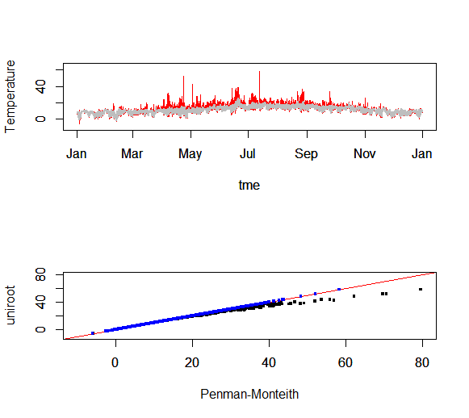

The temperature of this notional surface is mainly a theoretical construct, since real surfaces are rarely vertically uniform or isothermal. It represents an effective temperature at which the combined radiative, sensible, and latent heat fluxes balance. While not directly measurable, this quantity provides a useful physical reference and can be used to estimate near-surface air temperatures above vegetation, as shown below. Before doing that, we need to calculate a term called the wind friction velocity. We expand on this concept later. 

```{r eval=FALSE}
# Calculate wind friction velocity
uf <- (ka * climdata$windspeed) / log((zref - d) / zm)

# Select hottest hour
hr <- which.max(Ts1)
Ts <- Ts1[hr]              # surface temperature
Ta <- climdata$temp[hr]    # air temperature

# Calculate sensible heat flux
pk <- climdata$pres[hr]
cp <- cpair(Ta)         # specific heat of air
ph <- rhohair(Ta, pk)   # molar density of air

H <- ((ph * cp) / rHa[hr]) * (Ts - Ta)

# Calculate temperature profile above canopy
z <- seq(0.12, 2, length.out = 100)
Tz <- Ts - (H / (ka * ph * cp * uf[hr])) * log((z - d) / zh)

par(mfrow = c(1, 1))
plot(z ~ Tz, type = "l",
     xlab = "Temperature", ylab = "Height")
```
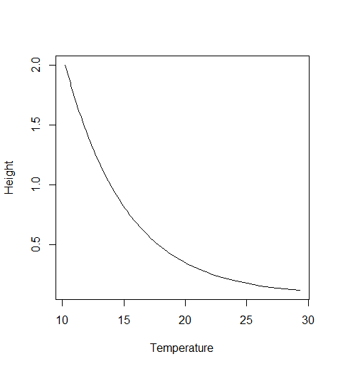

We now describe the radiation, sensible and latent heat component of the energy budget in more detail, beginning with the simpler case of deriving microclimate conditions above the canopy, before turning to the more complex situation below the canopy. We then turn to modelling ground heat flux, which itself requires modelling of soil water content. Before that there are a few tutorial exercises.

## Above canopy
### Radiation and albedo
In the simple example above, albedo — the fraction of shortwave radiation reflected rather than absorbed — was held constant. In reality, it varies with both ground reflectance and the reflectance of any overlying vegetation. Their relative contributions depend on how much radiation reaches the ground, which for the direct beam is determined by leaf inclination and the solar zenith angle: vertically oriented leaves intercept more sunlight when the sun is low in the sky. To account for this, we first need to calculate the solar zenith angle. The sunposition function does this from a POSIXlt time vector and a single latitude–longitude pair. It returns both the zenith angle (0 at the sun’s zenith, 90 at the horizon) and the azimuth (0 = north, 90 = east). Times must be in UTC. 

```{r eval=FALSE}
tme <- as.POSIXlt(climdata$obs_time, tz = "UTC")
solp <- sunposition(tme, lat = 49.96807, long = -5.215668)

plot(solp$zen ~ as.POSIXct(tme), type = "l",
     xlab = "Month", ylab = "Zenith angle")
```
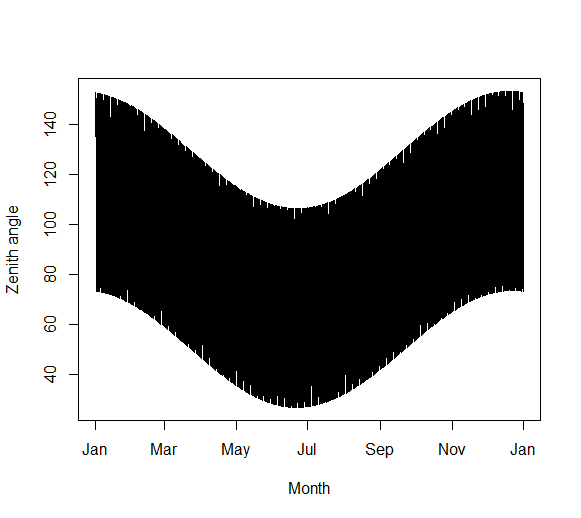
The reader may wish to use the `sunposition` function to explore how the solar zenith angle changes over the coarse of a single day or with latitude.

The `albedo` function handles albedo calculations, but before demonstrating it, we briefly turn to how direct radiation is attenuated through a vegetated canopy. Because this depends on leaf inclination, which is impractical to specify for individual leaves, we assume a continuous distribution of leaf angles following an oblate or prolate spherical form. This is reasonable for many canopies but may be less appropriate for species with strongly heliotropic leaves or highly directional foliage arrangements. The distribution is defined by a single parameter x, representing the ratio of vertical to horizontal leaf projections (x = 0 for completely horizontal leaves, x = infinity for completely vertical leaves, and x = 1 for random orientation). 

We also account for the possibility of sloping ground, which alters the optical path length through the canopy. This is handled by computing a solar coefficient that expresses the fraction of direct radiation intercepted by a surface relative to one perpendicular to the solar beam. Terrain shading could additionally be incorporated by setting direct radiation to zero when the sun is below the local horizon. From this, we derive an extinction coefficient that determines how strongly the canopy attenuates direct beam radiation per unit plant area index (PAI):

```{r eval=FALSE}
# Select daylight hours on June 21
sel <- which(tme$mon + 1 == 6 & tme$mday == 21 & solp$zen < 90)
solp2 <- lapply(solp, `[`, sel)

# Compute solar coefficient for flat surface
si <- solarindex(slope = 0, aspect = 180, solp2)

# Compute extinction coefficient
k1 <- cank(solp2, x = 1, si)
k2 <- cank(solp2, x = 0.1, si)
k3 <- cank(solp2, x = 10, si)

# Plot extinction coefficient
plot(k1 ~ solp2$zen, pch = 15, col = "black",
     xlim = c(0, 90), ylim = c(0, 12),
     xlab = "Zenith angle", ylab = "Extinction coefficient")
par(new = TRUE)
plot(k2 ~ solp2$zen, pch = 15, col = "blue",
     xlim = c(0, 90), ylim = c(0, 12),
     xlab = "", ylab = "")
par(new = TRUE)
plot(k3 ~ solp2$zen, pch = 15, col = "red",
     xlim = c(0, 90), ylim = c(0, 12),
     xlab = "", ylab = "")

legend("topleft", legend = c("x = 1", "x = 0.1", "x = 10"),
       col = c("black", "blue", "red"), pch = 15, bty = "n")
```
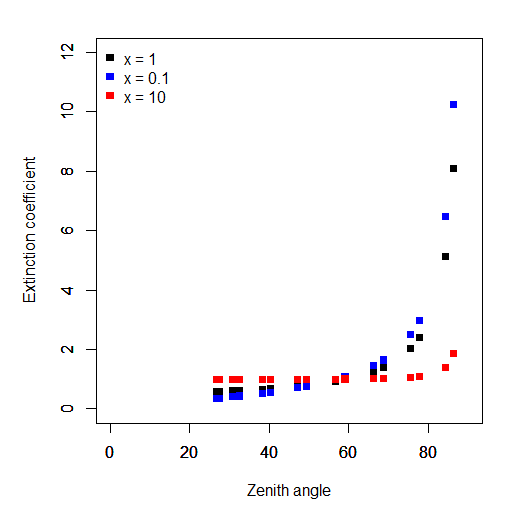

You can see here how leaf inclination affects the extinction coefficient: more vertically oriented leaves reduce attenuation when the sun is near its zenith but greatly increase it when the sun is low (high zenith angles). The `albedo` function calls `cank` so there is no need to compute the extinction coefficient separately. it requires several inputs as detailed in the comments below. Here typical values are chosen. The `scattermethod` input just determines which method to use to calculate radiation Scattering directionality factor (see `?scattercoef`). The Sellers method specified by default is marginally less accurate than the computationally more complex Pinty method. The `leafh` input is logical indicating whether the provided plant area index value is per unit horizontal ground area or per unit inclined ground area. 

```{r eval=FALSE}
pai <- 3      # plant area index (m^2 m^-2)
lref <- 0.4   # leaf reflectance
ltra <- 0.2   # leaf transmittance
x <- 1        # leaf inclination coefficient
gref <- 0.15  # ground reflectance
slope <- 30   # ground slope (degrees)
aspect <- 180 # ground aspect (degrees)

# Compute albedo variables
albvars <- albedo(pai, lref, ltra, x, gref, slope, aspect, solp,
                  scattermethod = "Sellers", leafh = FALSE)
```

The function returns albd, the white-sky albedo for diffuse radiation (independent of solar zenith angle and therefore time-invariant); albb, the black-sky albedo for direct radiation (time-varying); and K, the canopy extinction coefficient. To obtain the overall albedo, combine the white- and black-sky components by weighting them according to the fraction of total incoming radiation that is diffuse:

```{r eval=FALSE}
# Calculate diffuse fraction
difprop <- climdata$difrad / climdata$swdown
difprop[climdata$swdown == 0] <- 1

# Calculate albedo
alb <- difprop * albvars$albd + (1 - difprop) * albvars$albb

plot(alb ~ as.POSIXct(tme), type = "l", ylim = c(0, 1),
     xlab = "Month", ylab = "Albedo")
```
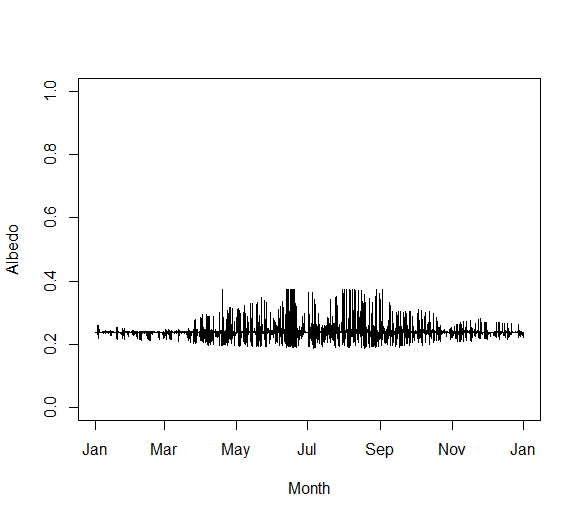

Sun-facing slopes absorb more direct radiation than flat ground, but the extent to which they do depends on how much of that radiation is intercepted by vegetation before reaching the surface. The albedo function returns weighting factors needed to calculate this absorption. These are then used by the `calcRabs` function, which brings everything together to estimate total absorbed radiation, including both shortwave and longwave components, the fraction intercepted and absorbed by vegetation and the fraction absorbed by the underlying ground surface.

Because `calcRabs` and related functions require multiple vegetation and ground parameters, these are grouped into single lists, as shown below. Parameter names follow the same convention as in the micropoint package.


```{r eval=FALSE}
# Create list of vegetation parameters
vegvars <- list(h = 0.12,    # vegetation height (m)
                pai = 1,     # plant area index
                x = 1,       # leaf inclination coefficient
                lref = 0.4,  # vegetation reflectance
                ltra = 0.2,  # vegetation transmittance
                em = 0.97)   # vegetation emissivity

# Create list of ground parameters
groundvars <- list(gref = 0.15, # ground reflectance
                   slope = 30,  # slope (degrees)
                   aspect = 180,# aspect (degrees)
                   em = 0.95)   # ground emissivity

# Calculate absorbed radiation
Rabs <- calcRabs(climdata, vegvars, groundvars,
                 lat = 49.96807, long = -5.215668)

# Plot absorbed radiation through time
plot(Rabs ~ as.POSIXct(tme), type = "l",
     xlab = "Month",
     ylab = expression("Absorbed radiation (W " * m^-2 * ")"))          
```
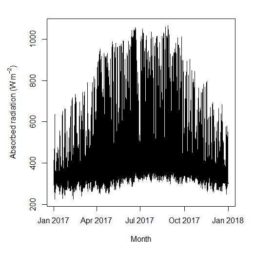

### Sensible heat and wind
The sensible heat flux from a vegetated surface depends on the temperature difference between the surface and the air at a reference height above the canopy, and on how easily moving air can carry that heat away (the convective conductivity, or the inverse of resistance to heat loss). Stronger winds reduce this resistance and allow more heat to be transferred. Because wind speed changes with height — slower near the surface and faster higher up — estimating this resistance requires describing how wind varies vertically. The key quantity that controls this wind-speed profile is the friction velocity, which is simply a measure of how strongly the wind interacts with and “drags” against the surface. In plain terms, it captures how vigorously the wind is stirring the air close to the ground: higher friction velocity means more turbulence and more efficient heat exchange.

The relationship between wind speed at reference height and friction velocity is set by two additional parameters: the roughness length for momentum, which reflects how rough the canopy surface is to the wind, and the zero-plane displacement height, the height above the ground surface at which the wind profile extrapolates to zero. Together, these describe how vegetation slows and redirects airflow, shaping the wind profile near the surface. In the simple example above these parameters were calculated from vegetation height, but in reality they have an additional dependence on the plant area index, and hence functions are included for calculating them.

A further complication is that roughness length, friction velocity, and resistance to heat loss all depend on thermally generated turbulence, quantified using diabatic corrections for momentum and heat. These corrections require that the sensible heat flux is known, yet estimating that flux also depends on dibatic coefficients, creating a circular problem that must be solved iteratively. I.e. when a surfaces is heated, the air above it becomes more turbulent and it looses heat more readily, and when it is cooled, the opposite occurs, but in both instances the degree of heat and cooling depends on how much turbulence there is. The `micropoint` package handles this iterative process automatically. In the examples below, we first show how vegetation height influences the shape of the wind and temperature profiles ignoring the diabatic correction coefficients (i.e. by setting the diabatic correction for momentum - `psim` and that for heat `psih` to zero). Below that we show how the how the diabatic correction coefficients can be derived iteratively and influence the shape of the profiles.

In the code below, we first define the wind speed at the reference height, the three canopy heights, and plant area index. We then compute zero-plane displacement, roughness length, and friction velocity for each canopy. Next, we create height vectors spanning from the top of each canopy to zref, apply the wind-profile function to each, and plot the resulting profiles, with dashed lines marking canopy height.

```{r eval=FALSE}
# Plot wind profiles for three canopy heights
uref <- 3            # wind speed at reference height (m s-1)
zref <- 2            # reference height (m)
h <- c(0.05, 0.1, 0.5) # vegetation heights (m)
pai <- 1             # plant area index

d <- zeroplanedis(h, pai)                     # zero-plane displacement
zm <- roughlength(h, pai, d, psih = 0)       # roughness length
uf <- windfric(uref, zref, d, zm, psim = 0)  # friction velocity

# Build height grids and wind profiles
z_list <- lapply(h, function(hi) seq(hi, zref, length.out = 100))
uz_list <- Map(function(z, ufi, di, zmi)
                 windprofile_above(z, ufi, di, zmi, psim = 0),
               z_list, as.list(uf), as.list(d), as.list(zm))

# Bind to matrices for plotting
Z <- do.call(cbind, z_list)
UZ <- do.call(cbind, uz_list)

# Plot wind profiles
cols <- c("red", "black", "blue")

matplot(UZ, Z, type = "l", lwd = 2, col = cols, lty = 1,
        xlab = "Wind speed (m s-1)",
        ylab = "Height (m)",
        xlim = c(0, 3), ylim = c(0, 2))

abline(h = h, lty = 2, col = cols)

legend("topright",
       legend = c("h = 0.05 m", "h = 0.1 m", "h = 0.5 m"),
       col = cols, lwd = 2, bty = "n")
```
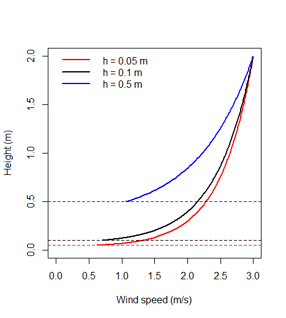
In the code below we set the air temperature and pressure at the reference height, assume a sensible heat flux of 200 W per square metre, and calculate the volumetric heat capacity of air. We then compute the resistance to zref for each canopy and use this to estimate its heat-exchange surface temperature. Next, we obtain resistances for each height vector and, together with the surface temperatures, derive temperature–height profiles, which are then plotted.

```{r eval=FALSE}
# Plot temperature profiles for three canopy heights
tref <- 15        # air temperature at reference height (°C)
pk <- 101.3       # pressure (kPa)
H <- 200          # sensible heat flux (W m^-2)

phcp <- rhohair(tref, pk) * cpair(tref) # volumetric heat capacity of air

# Resistance to reference height for each canopy
rHa_ref <- mapply(function(di, zmi, ufi)
  canopyresistance(zref, di, zmi, ufi, psih = 0),
  d, zm, uf)

# Heat-exchange surface temperature
th <- tref + (rHa_ref / phcp) * H

# Resistance and temperature profiles
rHa_z_list <- Map(function(z, di, zmi, ufi)
                    canopyresistance(z, di, zmi, ufi, psih = 0),
                  z_list, as.list(d), as.list(zm), as.list(uf))

tz_list <- Map(function(rHa_i, th_i)
                 th_i - (rHa_i / phcp) * H,
               rHa_z_list, as.list(th))

# Bind for plotting
TZ <- do.call(cbind, tz_list)
Z <- do.call(cbind, z_list)

# Plot profiles
matplot(TZ, Z, type = "l", lwd = 2, col = cols, lty = 1,
        xlab = expression("Temperature (" * degree * "C)"),
        ylab = "Height (m)",
        xlim = c(15, 25), ylim = c(0, 2))

abline(h = h, lty = 2, col = cols)

legend("topright",
       legend = paste("h =", h, "m"),
       col = cols, lwd = 2, lty = 1, bty = "n")
```
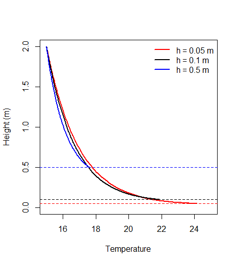
In the examples below, we show how the diabatic coefficients are derived iteratively and demonstrate their influence on the temperature and wind profiles. In contrast to the previous examples, we set the radiation absorbed the canopy (`Rabs`) and then calculate the sensible heat flux explicitly. In the first example we set a high value for `Rabs` to ensure surface heating. The diabatic coefficients `psim` and `psih` are initially set to zero, so the wind and temperature profiles are calculated as before, except that the sensible heat flux is now obtained from the heat-exchange surface temperature using `SolveEnergyBalance`, rather than specified directly. We then use a `while` loop to update the diabatic coefficients iteratively, repeating the calculations until `psim` converges. To do this, we calculate a quantity called the Obukhov length, which is simply a measure of the height above the surface where buoyancy begins to meaningfully influence turbulence, and is the main parameter used to calculate the degree of turbulence.

```{r eval=FALSE}
# -------------------------------------------------------------- #
# ************  Heated surface example ************************* #
# -------------------------------------------------------------- #

Rabs <- 1000 # absorbed radiation (W m^-2); high value heats canopy
z <- seq(0.12, 2, length.out = 100) # heights above a 0.12 m canopy (m)

# * * Compute wind profile assuming neutral atmospheric conditions * * #
d <- zeroplanedis(h = 0.12, pai = 1) # zero-plane displacement height
zm <- roughlength(h = 0.12, pai = 1, d, psih = 0) # roughness length for momentum transfer
uf <- windfric(uref = 3, zref = 2, d, zm, psim = 0) # friction velocity
uz1 <- windprofile_above(z, uf, d, zm, psim = 0)

# * * Compute temperature profile assuming neutral conditions * * #
rHa <- canopyresistance(z = 2, d, zm, uf, psih = 0) # aerodynamic resistance
th <- SolveEnergyBalance(Ta = 15, pk = 101.3, rh = 75, Rabs, rHa, rS = 100,
                         G = 0, em = 0.97,
                         method = "uniroot") # canopy temperature
phcp <- rhohair(15, 101.3) * cpair(15) # volumetric heat capacity of air
H <- (phcp / rHa) * (th - 15) # sensible heat flux
rHa <- canopyresistance(z, d, zm, uf, psih = 0) # resistance at each height
tz1 <- th - (rHa / phcp) * H # air temperature profile

# * * * * * Iterate to derive diabatic coefficients * * * * * #
psim <- psih <- 0 # initially assume neutral conditions
tol <- 1e-9 # convergence tolerance
error <- tol * 100

while (error > tol) {
  zm <- roughlength(h = 0.12, pai = 1, d, psih) # update roughness length
  uf <- windfric(uref = 3, zref = 2, d, zm, psim) # update friction velocity
  rHa <- canopyresistance(z = 2, d, zm, uf, psih) # update aerodynamic resistance

  th <- SolveEnergyBalance(Ta = 15, pk = 101.3, rh = 75, Rabs, rHa,
                           rS = 100, G = 0, em = 0.97,
                           method = "uniroot") # updated canopy temperature

  H <- (phcp / rHa) * (th - 15) # updated sensible heat flux
  oldpsim <- psim

  LL <- Obukhov(15, 101.3, uf, H) # Obukhov length
  psim <- dpsim(zm / LL) - dpsim((zref - d) / LL) # momentum correction
  psih <- dpsih((0.2 * zm) / LL) - dpsih((zref - d) / LL) # heat correction

  error <- abs(psim - oldpsim)
}

# * * Recalculate profiles including diabatic corrections * * #
psims <- dpsim(zm / LL) - dpsim((z - d) / LL)
psihs <- dpsih((0.2 * zm) / LL) - dpsih((z - d) / LL)

uz2 <- windprofile_above(z, uf, d, zm, psims) # wind profile with stability corrections
rHa <- canopyresistance(z, d, zm, uf, psihs)
tz2 <- th - (rHa / phcp) * H # temperature profile with stability corrections
```

In the following example we adopt exactly the same procedure, but here `Rabs` is set to a low value to simulate surface cooling.  

```{r eval=FALSE}
# -------------------------------------------------------------- #
# ************  Cooled surface example ************************* #
# -------------------------------------------------------------- #

Rabs <- 250 # absorbed radiation (W m^-2); low value cools canopy
z <- seq(0.12, 2, length.out = 100) # heights above a 0.12 m canopy (m)

# * * Compute temperature profile assuming neutral conditions * * #
rHa <- canopyresistance(z = 2, d, zm, uf, psih = 0) # aerodynamic resistance
th <- SolveEnergyBalance(Ta = 15, pk = 101.3, rh = 75, Rabs, rHa, rS = 100,
                         G = 0, em = 0.97,
                         method = "uniroot") # canopy temperature

phcp <- rhohair(15, 101.3) * cpair(15) # volumetric heat capacity of air
H <- (phcp / rHa) * (th - 15) # sensible heat flux

rHa <- canopyresistance(z, d, zm, uf, psih = 0) # resistance at each height
uz3 <- uz1 # unchanged because wind profile is initially neutral
tz3 <- th - (rHa / phcp) * H # air temperature profile

# * * * * * Iterate to derive diabatic coefficients * * * * * #
psim <- psih <- 0 # initially assume neutral conditions
tol <- 1e-9 # convergence tolerance
error <- tol * 100

while (error > tol) {
  zm <- roughlength(h = 0.12, pai = 1, d, psih) # update roughness length
  uf <- windfric(uref = 3, zref = 2, d, zm, psim) # update friction velocity
  rHa <- canopyresistance(z = 2, d, zm, uf, psih) # update aerodynamic resistance

  th <- SolveEnergyBalance(Ta = 15, pk = 101.3, rh = 75, Rabs, rHa,
                           rS = 100, G = 0, em = 0.97,
                           method = "uniroot") # updated canopy temperature

  H <- (phcp / rHa) * (th - 15) # updated sensible heat flux
  oldpsim <- psim

  LL <- Obukhov(15, 101.3, uf, H) # Obukhov length
  psim <- dpsim(zm / LL) - dpsim((zref - d) / LL) # momentum correction
  psih <- dpsih((0.2 * zm) / LL) - dpsih((zref - d) / LL) # heat correction

  error <- abs(psim - oldpsim)
}

# * * Recalculate temperature and wind profile * * #
psims <- dpsim(zm / LL) - dpsim((z - d) / LL)
psihs <- dpsih((0.2 * zm) / LL) - dpsih((z - d) / LL)

uz4 <- windprofile_above(z, uf, d, zm, psims) # wind profile with stability corrections
rHa <- canopyresistance(z, d, zm, uf, psihs) # resistance at each height
tz4 <- th - (rHa / phcp) * H # temperature profile with stability corrections
```

In the code below, we plot the wind and temperature profiles to illustrate the influence of the diabatic coefficients. 

```{r eval=FALSE}
# -------------------------------------------------------------- #
# ************  Plot both sets of profiles  ******************** #
# -------------------------------------------------------------- #

# Compare wind profiles
plot(z ~ uz1, type = "l", lwd = 2,
     xlim = c(0, 3), ylim = c(0, 2),
     xlab = expression("Wind speed (m s"^-1 * ")"),
     ylab = "Height (m)")

par(new = TRUE)
plot(z ~ uz2, type = "l", lwd = 2, col = "red",
     xlim = c(0, 3), ylim = c(0, 2),
     xlab = "", ylab = "")

legend("topleft", legend = c("Neutral", "Diabatic"),
       col = c("black", "red"), lwd = 2, bty = "n")

plot(z ~ uz3, type = "l", lwd = 2,
     xlim = c(0, 3), ylim = c(0, 2),
     xlab = expression("Wind speed (m s"^-1 * ")"),
     ylab = "Height (m)")

par(new = TRUE)
plot(z ~ uz4, type = "l", lwd = 2, col = "blue",
     xlim = c(0, 3), ylim = c(0, 2),
     xlab = "", ylab = "")

legend("topleft", legend = c("Neutral", "Diabatic"),
       col = c("black", "blue"), lwd = 2, bty = "n")

# Compare temperature profiles
plot(z ~ tz1, type = "l", lwd = 2,
     xlim = c(15, 24), ylim = c(0, 2),
     xlab = expression("Temperature (" * degree * "C)"),
     ylab = "Height (m)")

par(new = TRUE)
plot(z ~ tz2, type = "l", lwd = 2, col = "red",
     xlim = c(15, 24), ylim = c(0, 2),
     xlab = "", ylab = "")

legend("topright", legend = c("Neutral", "Diabatic"),
       col = c("black", "red"), lwd = 2, bty = "n")

plot(z ~ tz3, type = "l", lwd = 2,
     xlim = c(10, 15), ylim = c(0, 2),
     xlab = expression("Temperature (" * degree * "C)"),
     ylab = "Height (m)")

par(new = TRUE)
plot(z ~ tz4, type = "l", lwd = 2, col = "blue",
     xlim = c(10, 15), ylim = c(0, 2),
     xlab = "", ylab = "")

legend("topleft", legend = c("Neutral", "Diabatic"),
       col = c("black", "blue"), lwd = 2, bty = "n")
```
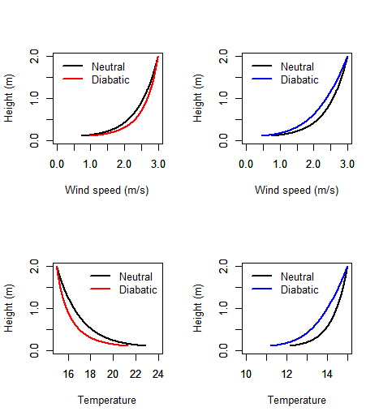

When the surface is heated, the diabatic coefficients increase turbulence, producing a slight increase in friction velocity (`uf`) and a more curved wind profile than under neutral conditions. When the surface is cooled, the diabatic coefficients suppress turbulence, reducing uf and producing a less curved profile. The temperature profiles behave similarly: under heating, the diabatic coefficients reduce resistance to heat loss, lowering canopy-top temperatures relative to the neutral case while increasing profile curvature. Under cooling, resistance to heat loss increases, leading to stronger thermal stratification and less curvature in the profile.

### Latent heat and stomatal conductance
In our simple microclimate example, bulk surface stomatal resistance to vapour loss is calculated using a basic approach in which stomata respond only to photosynthetically active radiation. In reality, transpiration is a dynamic, regulated process: stomata respond to light, humidity, temperature, and soil moisture, balancing carbon uptake against the risk of excessive water loss. Capturing this behaviour requires a more detailed representation of stomatal resistance. The model presented below is an analytical stomatal-optimisation scheme developed as part of the xylem-hydraulics component of the Joint UK Land Environment Simulator (JULES) land-surface model (Ellers et al., 2020).

This model is relatively parameter-rich, so a table of values for major plant functional types is included with the tutorial package. The helper function createplant_inputs() extracts the relevant values and returns a ready-to-use vector of vegetation parameters for a chosen plant functional type. The available plant functional types (see ?PFTtable) are intentionally broad and are best treated as starting points for more detailed, site- or species-specific parameterisation. For example, a nominal vegetation height is provided, but users will often have better information for their target vegetation. Many of the remaining traits correspond to those available in the TRY database.

In the example below, we first extract vegetation parameters for C3 grass and then run the key function stomatalcond_calc. This returns stomatal conductance (the inverse of resistance), calculated at the leaf scale. Although the model is intended for individual leaves, it is useful to first explore how conductance responds to environmental drivers, so we illustrate this here.

```{r eval=FALSE}
# Create list of vegetation parameters
vegparams <- createplant_inputs("C3")

# Plot stomatal response to climate inputs
z <- vegparams$h / 2 # average canopy height

par(mfrow = c(2, 3))

# CO2 concentration
Ca <- 280:450 # CO2 concentration (ppm)

gs <- stomatalcond_calc(Ca, Rsw = 500, tair = 20, tleaf = 25,
                        rh = 75, pk = 101.3, psi_r = -0.005,
                        vegparams, z, C3 = TRUE)

plot(gs ~ Ca, type = "l",
     xlab = expression(CO[2] ~ "concentration (ppm)"),
     ylab = "Stomatal conductance",
     ylim = c(0, 0.1))

# Shortwave radiation
Rsw <- 0:1000 # incident shortwave radiation (W m^-2)

gs <- stomatalcond_calc(Ca = 400, Rsw, tair = 20, tleaf = 25,
                        rh = 75, pk = 101.3, psi_r = -0.005,
                        vegparams, z, C3 = TRUE)

plot(gs ~ Rsw, type = "l",
     xlab = expression("Solar radiation (W " * m^-2 * ")"),
     ylab = "Stomatal conductance",
     ylim = c(0, 0.1))

# Air temperature
tair <- (100:300) / 10 # air temperature (°C)

gs <- stomatalcond_calc(Ca = 400, Rsw = 500, tair, tleaf = 25,
                        rh = 75, pk = 101.3, psi_r = -0.005,
                        vegparams, z, C3 = TRUE)

plot(gs ~ tair, type = "l",
     xlab = expression("Air temperature (" * degree * "C)"),
     ylab = "Stomatal conductance",
     ylim = c(0, 0.1))

# Leaf temperature
tleaf <- (100:300) / 10 # leaf temperature (°C)

gs <- stomatalcond_calc(Ca = 400, Rsw = 500, tair = 20, tleaf,
                        rh = 75, pk = 101.3, psi_r = -0.005,
                        vegparams, z, C3 = TRUE)

plot(gs ~ tleaf, type = "l",
     xlab = expression("Leaf temperature (" * degree * "C)"),
     ylab = "Stomatal conductance",
     ylim = c(0, 0.1))

# Relative humidity
rh <- 50:100 # relative humidity (%)

gs <- stomatalcond_calc(Ca = 400, Rsw = 500, tair = 20, tleaf = 25,
                        rh, pk = 101.3, psi_r = -0.005,
                        vegparams, z, C3 = TRUE)

plot(gs ~ rh, type = "l",
     xlab = "Relative humidity (%)",
     ylab = "Stomatal conductance",
     ylim = c(0, 0.1))

# Atmospheric pressure
pk <- c(980:1040) / 10 # pressure (kPa)

gs <- stomatalcond_calc(Ca = 400, Rsw = 500, tair = 20, tleaf = 25,
                        rh = 75, pk, psi_r = -0.005,
                        vegparams, z, C3 = TRUE)

plot(gs ~ pk, type = "l",
     xlab = "Atmospheric pressure (kPa)",
     ylab = "Stomatal conductance",
     ylim = c(0, 0.1))
```
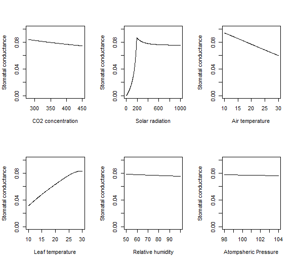

Stomatal conductance is sensitive to CO2 and strongly responsive to solar radiation under low light conditions. It also responds to leaf–air temperature differences, but shows weaker sensitivity to other climatic variables. In practice, leaves can regulate their temperature by increasing transpiration when they get too hot.

The final environmental input is soil water potential, which captures drought stress. Because most ecologists are more familiar with volumetric soil moisture, the package includes a helper function to convert moisture to water potential. This conversion requires three soil parameters: saturated volumetric water content, a shape parameter (`b`), and the air-entry water potential (`psi_e`). Lookup values for these parameters are provided in the built-in `soilparams` dataset in the `micropoint` package; in the example below, we use values for clay loam. 

```{r eval=FALSE}
# Check soil parameter table
?micropoint::soilparams

# Select values for clay loam
Smin <- 0.091 # volumetric water content at wilting point
Smax <- 0.419 # volumetric water content at saturation
b <- 5.2      # shape parameter
psie <- 2.6   # air-entry water potential

theta <- seq(Smin, Smax, length.out = 100) # volumetric water content
psi_r <- PsiFromtheta(theta, psie, b, Smax) # soil water potential

gs <- stomatalcond_calc(Ca = 400, Rsw = 500, tair = 20, tleaf = 25,
                        rh = 75, pk = 101.3, psi_r,
                        vegparams, z, C3 = TRUE)

par(mfrow = c(1, 1))

plot(gs ~ theta, type = "l",
     xlab = expression("Volumetric water content (m"^3 * " m"^-3 * ")"),
     ylab = "Stomatal conductance",
     ylim = c(0, 0.1))
```
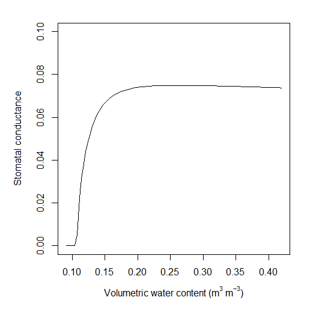

Here we see that leaves sharply restrict water loss as soil moisture declines.

Next, we scale stomatal conductance from individual leaves to the canopy as a whole. In principle this could be done by summing conductances across all leaves, but a simpler and more practical approach is to assume that the dominant source of within-canopy variation in stomatal conductance is the availability of photosynthetically active radiation (PAR). We therefore partition the canopy into sunlit and shaded components, compute the total sunlit and shaded leaf area per unit ground area, and estimate representative PAR flux densities for each. Leaf-level stomatal conductance is then evaluated under these two light regimes and scaled to the canopy by weighting by the corresponding sunlit and shaded leaf area. This is done using the function `bulkstomatalresist_calc` (which returns resistance as opposed to conductance). To compute the sunlit leaf area we also need to know the sun's position, hence this is provided as an input. Below we demonstrate how bulk stomatal conductance scales relative to leaf stomatal conductance as a function of plant area

```{r eval=FALSE}
# ===================================================================== #
# ~~~~~~~~~~ Compute leaf stomatal conductance for C3 grass ~~~~~~~~~~~ #
# ===================================================================== #

# Compute sun position at midday on 21 May 2025 in Cornwall, UK
tme <- as.POSIXlt(0, origin = "2025-05-21 12:00", tz = "UTC")
solp <- sunposition(tme, 50, -5)

# Derive vegetation parameters
vegparams <- createplant_inputs("C3")

# Compute absorbed PAR radiation
Rsw <- 800  # shortwave radiation (W m^-2)
Rdif <- 300 # diffuse radiation (W m^-2)

om <- vegparams$lrefp + vegparams$ltrap # leaf reflectance + transmittance (PAR)

k <- cank(solp, x = 1,
          cos(solp$zen * pi / 180)) # canopy extinction coefficient

# Compute absorbed radiation
# -- (Rsw - Rdif) gives direct beam radiation
# -- k determines the fraction intercepted by leaves
# -- Rdif adds diffuse radiation separately
# -- (1 - om) accounts for absorbed rather than scattered radiation
Rswabs <- (1 - om) * (k * (Rsw - Rdif) + Rdif)

# Compute stomatal conductance
gs <- stomatalcond_calc(Ca = 430, Rswabs, tair = 11, tleaf = 30,
                        rh = 75, pk = 101.3, psi_r = 0,
                        vegparams, z = vegparams$h / 2)

# ===================================================================== #
# ~~~~~~~~ Compute bulk stomatal conductance for C3 grass ~~~~~~~~~~~~~ #
# ===================================================================== #

PAI <- (1:400) / 100

# Compute bulk stomatal resistance
rS <- 0
vegp2 <- vegparams

for (i in 1:length(PAI)) {
  vegp2$pai <- PAI[i]

  rS[i] <- bulkstomatalresist_calc(solp, Ca = 430, Rsw, Rdif,
                                   tair = 11, tcanopy = 30,
                                   rh = 75, pk = 101.3,
                                   psi_r = 0, vegp2)
}

# Convert to bulk stomatal conductance
gS <- rhohair(11, 101.3) / rS

# ===================================================================== #
# Compute ratio of bulk surface to leaf conductance and plot results
# ===================================================================== #

ratio <- gS / gs

par(mar = c(6, 6, 3, 3))

plot(ratio ~ PAI, type = "l",
     cex.axis = 2, cex.lab = 2,
     xlab = "Plant area index",
     ylab = expression(g[S] / g[s]))

abline(h = 1, lty = 2, col = "red")
```
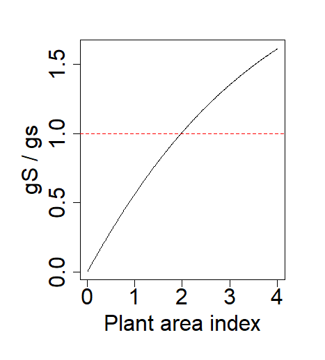

We can see that the ratio doesn't scale linearly with the total plant area index because of the degree of shelf-shading. The bulk stomatal conductance when PAI = 4 is only 1.62 times higher than leaf conductance.

### A more complex microclimate model
We now combine the concepts described previously to simulate canopy microclimate using the `solve_wholecanopy` function. For each hour, this function calculates absorbed radiation using `calcRabs`, iteratively solves for diabatic coefficients, friction velocity, and bulk surface stomatal resistance, and updates canopy temperature until convergence. Soil water content and ground heat storage are specified using simplified inputs. Because calculations are performed independently for each hour, the function must be called sequentially to generate a time series; here we illustrate this for June.

We first define input parameters, starting from defaults for a C3 grassland but reducing canopy height and plant area index. Atmospheric CO2 is estimated using functions from `micropoint`, and weather data are subset to June.

We then define vectors for soil water content and ground heat storage and call `solve_wholecanopy` for each hour. Finally, we show how the outputs can be used to estimate air temperature at 0.2 m above ground.

```{r eval=FALSE}
# ----------------------- Create data inputs ------------------------------- #
weather <- micropoint::climdata

tme <- as.POSIXlt(weather$obs_time, tz = "UTC")
sel <- which(tme$mon + 1 == 6) # select hours in June

weather <- weather[sel,]

groundp <- micropoint::groundparams

vegp <- createplant_inputs("C3")
vegp$h <- 0.12  # vegetation height (m)
vegp$pai <- 0.5 # plant area index

Ca <- micropoint::Cafromyear(2017) # atmospheric CO2 concentration (ppm)

# ------------------- Estimate rate of ground heat storage ----------------- #

# Calculate diurnal temperature range
tday <- matrix(weather$temp, nrow = 24)

tmax <- apply(tday, 2, max, na.rm = TRUE)
tmin <- apply(tday, 2, min, na.rm = TRUE)

dtr <- rep(tmax - tmin, each = 24)

# Simulate sinusoidal daily cycle peaking at 3 pm
daycycle <- sin(pi / 12 * ((0:719) - 9))

# Scale by diurnal temperature range
G <- sqrt(0.5 * dtr) * 25 * daycycle

# -------- Simulate soil water content and surface humidity ---------------- #

theta <- (0.1 * sin(pi / 4380 * ((0:8759) + 2000)) + 0.3)[sel] # root zone
thetas <- (0.15 * sin(pi / 4380 * ((0:8759) + 2000)) + 0.21)[sel] # surface

soilrh <- with(groundp,
               soilrelhum(thetas, 15, Psie, b, Smax))

reqhgt <- 0.2 # target height for air temperature (m)

# ------------------------- Cycle through each hour ------------------------ #

Tz <- 0 # initialise temperature vector

for (hr in 1:720) {

  # --------------------- Run canopy solver -------------------------------- #
  can <- solve_wholecanopy(weather, vegp, groundp, hr,
                           lat = 49.96807, long = -5.215668,
                           zref = 2, G[hr],
                           theta[hr], soilrh[hr], Ca)

  # ------------- Calculate diabatic coefficient at reqhgt ----------------- #
  d <- zeroplanedis(vegp$h, vegp$pai) # zero-plane displacement height

  zm <- roughlength(vegp$h, vegp$pai, d,
                    can$psih) # roughness length (momentum)

  zh <- 0.2 * zm # roughness length (heat)

  psih <- dpsih(zh / can$LL) -
          dpsih((reqhgt - d) / can$LL) # diabatic correction

  # ---------------- Calculate temperature at reqhgt ----------------------- #

  # Volumetric heat capacity of air
  phcp <- rhohair(weather$temp[hr], weather$pres[hr]) *
          cpair(weather$temp[hr])

  # Air temperature profile
  mu <- can$H / (0.41 * phcp * can$uf)

  Tz[hr] <- can$tcanopy -
            mu * (log((reqhgt - d) / zh) + psih)
}

# ----------------------------- Plot results ------------------------------- #

tmem <- as.POSIXct(tme[sel])

# Plot reference air temperature
plot(weather$temp ~ tmem, type = "l",
     xlab = "Date",
     ylab = expression("Temperature (" * degree * "C)"),
     ylim = c(5, 35),
     lwd = 2,
     col = rgb(0, 0, 0, 0.5))

# Plot microclimate air temperature 20 cm above ground
par(new = TRUE)

plot(Tz ~ tmem, type = "l",
     xlab = "Date",
     ylab = "",
     ylim = c(5, 35),
     col = "red")

legend("topright",
       legend = c("Reference air temperature",
                  "Microclimate temperature"),
       col = c(rgb(0, 0, 0, 0.5), "red"),
       lwd = 2,
       bty = "n")
```
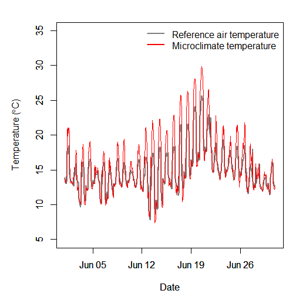

Though described as more complex, the processes outlined so far are in fact a simplification, treating the vegetation surface as a homogeneous layer with no vertical temperature variation and a single canopy-scale energy balance. In reality, most canopies exhibit strong vertical temperature gradients, making this assumption inaccurate. Resolving these gradients requires representing the canopy as interacting vertical layers, each with its own energy balance, where conditions reflect both local leaf exchange and heat transported from elsewhere in the canopy. We tackle this in the next section, but a key requirement is estimating the Lagrangian timescale—the characteristic time over which air retains the thermal influence of leaves as it moves through the canopy. This is not directly observable, and is typically inferred by assuming that effective thermal diffusivity—the efficiency of heat transport by turbulent mixing—transitions smoothly from within the canopy to the air above. The derivation of this approach is outlined in the accompanying equations vignette.

## Below canopy

### Two-stream radiation models
A two-stream radiation model extends the concepts introduced for albedo by explicitly representing the downward and upward fluxes of shortwave radiation within the canopy, treating radiation as a set of interacting streams. The downward diffuse stream is attenuated as a function of cumulative plant area, with a proportion of this radiation reflected upward and subsequently scattered back downward, leading to repeated exchanges between upward and downward diffuse fluxes. In parallel, the direct stream is attenuated as it penetrates the canopy, again as a function of cumulative plant area, but also depending on leaf inclination, represented by the parameter x as in the albedo formulation. A fraction of the direct radiation is scattered and reflected, contributing to both the upward and downward diffuse streams and thereby coupling the direct and diffuse components.

The `twostream` function implements these processes by combining vegetation properties (leaf area, reflectance, and transmittance) with ground surface characteristics (reflectance, slope, and aspect), together with information on solar position and the total and diffuse downward fluxes at the top of the canopy. The function returns the downward and upward diffuse fluxes, the downward direct flux, as well as the shortwave radiation absorbed by leaves and the underlying ground surface.

To illustrate the application of the `twostream`, we first create the necessary vegetation inputs, including a profile of plant area index values and multiple heights in the canopy. We use inbuilt datasets and functions in the `micropoint`
package to do this:

```{r eval=FALSE}
# Use inbuilt vegetation parameter dataset from micropoint package
vegp <- micropoint::forestparams

# Generate vertical profile of plant area index using micropoint::PAIgeometry
paii <- micropoint::PAIgeometry(PAI = vegp$pai,
                                skew = vegp$skew,
                                spread = vegp$spread,
                                n = 1000)

z <- ((1:1000) / 1000) * vegp$h # height above ground (m)

plot(z ~ paii, type = "l",
     xlab = "Plant area index density",
     ylab = "Height (m)",
     main = paste0("Total PAI: ", round(sum(paii), 2)))
```
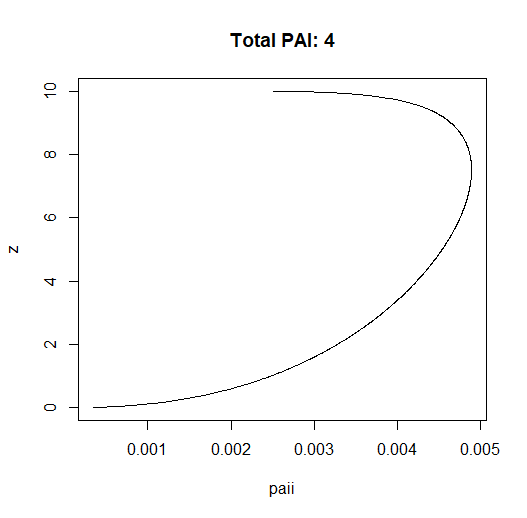

Next we generate the rest of the required inputs:

```{r eval=FALSE}
# Extract data for a sunny hour
weather <- micropoint::climdata

swdown <- weather$swdown[4094] # incoming shortwave radiation (W m^-2)
difrad <- weather$difrad[4094] # diffuse radiation (W m^-2)

# Calculate sun position at that hour
tme <- as.POSIXlt(weather$obs_time[4094], tz = "UTC")
solp <- sunposition(tme, lat = 49.96807, long = -5.215668)
```

After that, it is a simple case of running the twostream model. In the example below, we also plot outputs to show how the fluxes vary with height within the canopy

```{r eval=FALSE}
# Run two-stream model and plot radiation fluxes
groundp <- micropoint::groundparams

tsmod <- twostream(vegp, groundp, paii,
                   swdown, difrad,
                   lat, long, solp)

plot(z ~ tsmod$Rdirdown, type = "l", col = "red", lwd = 2,
     xlab = expression("Radiation flux (W " * m^-2 * ")"),
     ylab = "Height (m)",
     xlim = c(0, 750), ylim = c(0, 10))

par(new = TRUE)
plot(z ~ tsmod$Rdifdown, type = "l", col = "blue", lwd = 2,
     xlab = "", ylab = "",
     xlim = c(0, 750), ylim = c(0, 10))

par(new = TRUE)
plot(z ~ tsmod$Rswup, type = "l", col = "black", lwd = 2,
     xlab = "", ylab = "",
     xlim = c(0, 750), ylim = c(0, 10))

par(new = TRUE)
plot(z ~ tsmod$Rleafabs, type = "l", col = "darkgreen", lwd = 2,
     xlab = "", ylab = "",
     xlim = c(0, 750), ylim = c(0, 10))

legend("bottomright",
       legend = c("Direct downward",
                  "Diffuse downward",
                  "Upward shortwave",
                  "Leaf absorption"),
       col = c("red", "blue", "black", "darkgreen"),
       lwd = 2,
       bty = "n")
```
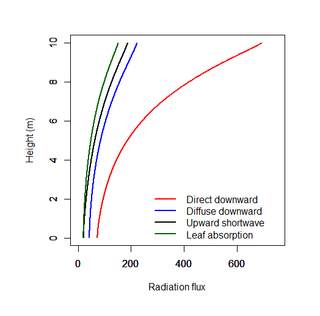

The function also returns radiation absorbed by sunlit and shaded leaves separately, as this becomes relevant when computing stomatal conductance. We return to that later.           

### Longwave radiation
To calculate downward and upward longwave fluxes, and longwave radiation absorbed by leaves, we require the downward longwave flux from the sky, ground surface temperature, and the temperature profile of the canopy. The `longwavebelow` function combines these inputs to derive the resulting fluxes.

The code below generates a plausible leaf temperature profile, defines inputs, calls the function, and plots the resulting flux profiles.

```{r eval=FALSE}
# Create PAI profile using micropoint::PAIgeometry
paii <- micropoint::PAIgeometry(PAI = 4,
                                skew = 7,
                                spread = 70,
                                n = 100)

# Generate leaf temperature profile
z <- (1:100) / 10 # height above ground (m)
tleaf <- 3 * cos(1 - z / 10) + 13.5 # leaf temperature (°C)

# Call longwavebelow function
lwb <- longwavebelow(paii,
                     lwdown = 300,
                     tleaf,
                     tground = 15,
                     vegem = 0.97,
                     groundem = 0.97)

# Plot longwave radiation fluxes
plot(z ~ lwb$Rlwdown, type = "l", col = "red", lwd = 2,
     xlab = expression("Radiation flux (W " * m^-2 * ")"),
     ylab = "Height (m)",
     xlim = c(250, 450), ylim = c(0, 10))

par(new = TRUE)
plot(z ~ lwb$Rlwup, type = "l", col = "blue", lwd = 2,
     xlab = "", ylab = "",
     xlim = c(250, 450), ylim = c(0, 10))

par(new = TRUE)
plot(z ~ lwb$RlwLabs, type = "l", col = "darkgreen", lwd = 2,
     xlab = "", ylab = "",
     xlim = c(250, 450), ylim = c(0, 10))

legend("bottomleft",
       legend = c("Downward longwave",
                  "Upward longwave",
                  "Leaf absorption"),
       col = c("red", "blue", "darkgreen"),
       lwd = 2,
       bty = "n")
```
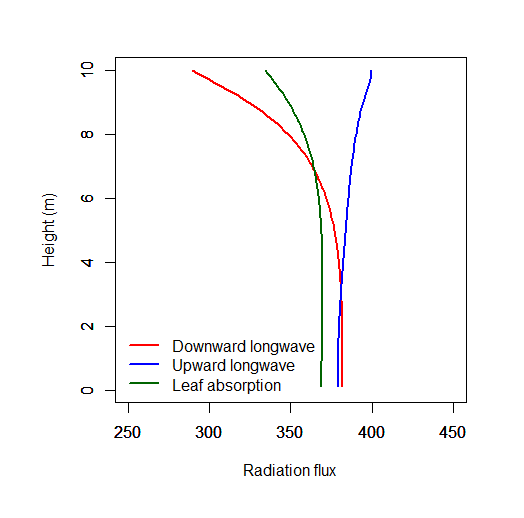

### Wind speed
The shape of the wind profile below canopy does not match that above canopy and is partially contingent on the vertical distribution of foliage. We illustrate this, but simulating two different foliage profiles and the calculating the wind profile for each using the inbuilt function `windprofile_below`.

```{r eval=FALSE}
paii_skew <- micropoint::PAIgeometry(PAI = 4,
                                     skew = 3,
                                     spread = 70,
                                     n = 100) # skewed PAI profile

paii_unif <- rep(4 / 100, 100) # uniform PAI profile

# ----------------- Generate wind profiles ------------------------- #

uh <- 3 # wind speed at canopy top (m s^-1)

wind_skew <- windprofile_below(hgt = 25, paii_skew, uh)
wind_unif <- windprofile_below(hgt = 25, paii_unif, uh)

# ----------------------- Plot results ----------------------------- #

z <- ((1:100) / 100) * 25 # height above ground (m)

par(mfrow = c(1, 2))

# Foliage profiles
plot(z ~ paii_skew, type = "l", lwd = 2, col = "darkgreen",
     xlab = "PAI density",
     ylab = "Height (m)",
     xlim = c(0, 0.06))

par(new = TRUE)
plot(z ~ paii_unif, type = "l", lwd = 2, col = "blue",
     xlab = "", ylab = "",
     xlim = c(0, 0.06))

legend("topright",
       legend = c("Skewed profile", "Uniform profile"),
       col = c("darkgreen", "blue"),
       lwd = 2,
       bty = "n")

# Wind profiles
plot(z ~ wind_skew, type = "l", lwd = 2, col = "darkgreen",
     xlab = expression("Wind speed (m s"^-1 * ")"),
     ylab = "Height (m)",
     xlim = c(0, 3))

par(new = TRUE)
plot(z ~ wind_unif, type = "l", lwd = 2, col = "blue",
     xlab = "", ylab = "",
     xlim = c(0, 3))

legend("bottomright",
       legend = c("Skewed profile", "Uniform profile"),
       col = c("darkgreen", "blue"),
       lwd = 2,
       bty = "n")
```
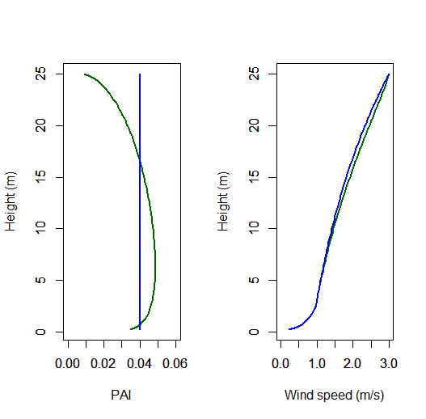

### Leaf temperature
To compute leaf temperature, we use `SolveEnergyBalance()`. This requires the relevant resistances to be specified. The resistance to heat loss is calculated with `leafresistance()`, which controls the transfer of heat between the leaf surface and the surrounding air. This depends on wind speed and leaf size and shape: faster wind and smaller leaves reduce resistance, allowing more efficient heat exchange. The function uses standard heat transfer relationships to represent both wind-driven and buoyancy-driven exchange, determining how strongly leaf temperature is coupled to the surrounding air.

Stomatal resistance, described earlier, controls the rate of water vapour loss from the leaf and depends on light, temperature, humidity, and water status. Within the canopy, not all leaves receive the same light: some are directly illuminated (sunlit), while others are shaded. Because stomatal conductance responds strongly to light, it is calculated separately for sunlit and shaded leaves using the radiation from the two-stream model. These are then combined according to the fraction of leaf area that is sunlit at each height, giving an effective stomatal resistance for each layer.

Accurate calculation of absorbed radiation also depends on leaf temperature through longwave exchange, so in principle this should be solved iteratively. Here, however, we simplify by assuming leaf temperature is 1 °C warmer than the air when calculating absorbed radiation. The example below calculates leaf temperature for a typical canopy using the absorbed-radiation procedure described above.

```{r eval=FALSE}
# -------------------------- Derive model inputs -------------------------- #
groundp <- micropoint::groundparams
vegp <- createplant_inputs("BDT") # deciduous broadleaf trees
paii <- micropoint::PAIgeometry(PAI = vegp$pai,
                                skew = 7,
                                spread = 70,
                                n = 100)

# ----------------------- Set initial temperatures ------------------------ #
tleaf <- rep(26, 100) # initial leaf temperature (°C)
tair <- rep(25, 100)  # initial air temperature (°C)
tground <- 25         # ground temperature (°C)
rh <- rep(80, 100) # initial relative humidity (%)

# ---------------------- Calculate absorbed radiation --------------------- #
# Run two-stream model
tme <- as.POSIXlt(0, origin = "2026-05-21 12:00", tz = "UTC")
solp <- sunposition(tme,
                    lat = 49.96807,
                    long = -5.215668)
tsmod <- twostream(vegp, groundp, paii,
                   swdown = 839,
                   difrad = 223,
                   lat = 49.96807,
                   long = -5.215668,
                   solp)

# Run longwave model
lwb <- longwavebelow(paii,
                     lwdown = 300,
                     tleaf,
                     tground,
                     vegem = 0.97,
                     groundem = 0.97)
Rabs <- lwb$RlwLabs + tsmod$Rleafabs # absorbed radiation (W m^-2)

# ----------------------- Calculate heat resistance ----------------------- #
uh <- 2 # wind speed at canopy top (m s^-1)
uz <- windprofile_below(vegp$h, paii, uh) # wind profile within canopy

dT <- abs(tleaf - tair) # temperature difference - used with low wind speed
rHa <- leafresistance(tair, dT, uz,
                      vegp$len, vegp$wid, vegp$x)

# -------------------- Calculate stomatal resistance ---------------------- #
# Calculate sunlit and shaded PAR
tsmod <- twostream(vegp, groundp, paii,
                   swdown = 839,
                   difrad = 223,
                   lat = 49.96807,
                   long = -5.215668,
                   solp,
                   PAR = TRUE)

z <- ((1:100) / 100) * vegp$h # height above ground (m)

# Sunlit leaf stomatal conductance (mol m^-2 s^-1)
gs_sun <- stomatalcond_calc(Ca = 430,
                            tsmod$Rsun,
                            tair,
                            tleaf,
                            rh,
                            pk = 101.3,
                            psi_r = -0.5,
                            vegp,
                            z)

# Shaded leaf stomatal conductance (mol m^-2 s^-1)
gs_shade <- stomatalcond_calc(Ca = 430,
                              tsmod$Rshade,
                              tair,
                              tleaf,
                              rh,
                              pk = 101.3,
                              psi_r = -0.5,
                              vegp,
                              z)

# Combine sunlit and shaded fractions
gs <- gs_sun * tsmod$sunlitfrac +
      (1 - tsmod$sunlitfrac) * gs_shade

ph <- rhohair(tair, pk = 101.3) # air density (mol m^-3)
rS <- ph / gs # stomatal resistance (s m^-1)

# ---------------------- Derive leaf temperature -------------------------- #
tleaf <- SolveEnergyBalance(tair,
                            pk = 101.3,
                            rh,
                            Rabs,
                            rHa,
                            rS,
                            G = 0,
                            em = 0.97,
                            method = "Penman",
                            iters = 4)

# ---------------------- Plot leaf temperature profile -------------------- #
par(mfrow = c(1, 1))
plot(z ~ tleaf, type = "l", lwd = 2, col = "darkgreen",
     xlab = expression("Leaf temperature (" * degree * "C)"),
     ylab = "Height (m)",
     xlim = c(24, 28))
```
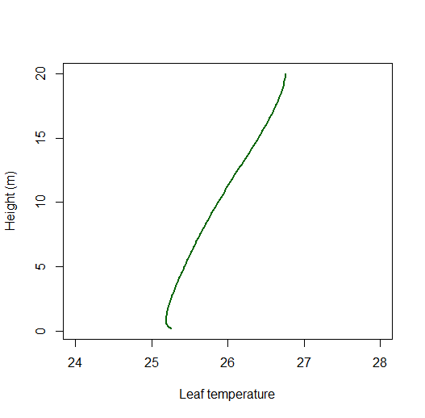

### Air temperature and humidity
Here we show how to calculate air temperature and humidity within the canopy. In the leaf temperature and longwave radiation examples these were treated as known inputs, but here they are instead determined from heat and water vapour exchange within the canopy.

Air temperature and humidity at any given height within the canopy are influenced not only by local exchanges, but also by exchanges occurring elsewhere in the canopy. Conditions at a point therefore reflect two components: a local contribution from nearby leaves, and a distributed contribution from heat and vapour exchanged throughout the canopy. The functions temp_below and relhum_below implement this using Raupach’s (1989a,b) localized near-field approach, combining these local and distributed effects to determine conditions at each height. In practice, the canopy is divided into vertical layers, and the fluxes from each layer are used to calculate the resulting air temperature and humidity profiles, with transfer between layers controlled by wind-driven mixing.


In the code below, we calculate air temperature and humidity within the canopy by working through the coupling between leaves and air. We begin with initial guesses of air temperature and humidity, use these to calculate leaf temperature and the associated heat and vapour exchange, and then use those exchanges to update the air temperature and humidity profiles. This process is repeated until the air conditions are consistent with the exchanges from the leaves throughout the canopy.

We begin by assembling the inputs needed to run the model: weather data and ground and vegetation parameters. The canopy is then divided into 100 layers, with plant area distributed through the profile to define how much leaf material is present at each height. Finally, atmospheric CO₂ concentration is specified for use in the stomatal calculations later on.

In the next step, we run solve_wholecanopy(). This is used to derive key inputs required for the profile calculations, including wind speed at the top of the canopy and the Lagrangian timescale, which controls how heat and vapour are transferred between layers. Then we extract the required climate variables for hour 4094 (the hottest hour in the dataset). We also specify initial profiles of air temperature and humidity, which provide the starting point for calculating leaf temperature and longwave radiation before the iterative solution begins. 

We then run the two-stream and longwave radiation models to calculate absorbed radiation, and use this to derive leaf temperature. From this, we obtain the sensible and latent heat fluxes from each canopy layer, which are among the variables passed to the temperature and humidity profile functions. These are then used in temp_below() and relhum_below() to update the air temperature and humidity profiles.

Because leaf temperature depends on air temperature and humidity, and these in turn depend on the heat and vapour fluxes from the leaves, the calculation is carried out within a while loop. At each iteration, leaf temperature is updated, the resulting fluxes are recalculated, and the air profiles are updated again. This is repeated until the profiles are consistent with the exchanges throughout the canopy.

After updating the air temperature and humidity profiles, we do not immediately feed these new values back into the next iteration. In simpler iterative examples this can work, but here it tends to produce see-sawing, with successive estimates overshooting in opposite directions rather than settling smoothly. This is especially a problem near the bottom of the canopy, where exchange with the ground adds an additional strong source or sink of heat and vapour.

To avoid this, we apply a weighted Aitken relaxation step. The basic idea of relaxation is simple: rather than jumping all the way from the previous estimate to the newly calculated one, we move only part of the way. This partial update can be thought of as a backweighting of the new solution, pulling it back towards the previous one to reduce instability. The Aitken method improves on a fixed relaxation factor by adjusting this weighting dynamically from one iteration to the next, based on how the residuals are changing. If the solution is settling smoothly, the method allows larger steps; if it is oscillating, it applies stronger damping.The updated values are then used for the next iteration, and the process repeats until the change between successive temperature profiles as measured by the `error` term becomes small enough that it is below the specified tolerance limit.

In the final section, we plot the leaf and air temperature and humidity profiles. Relative humidity is converted to vapour pressure, as leaf-level relative humidity is not very meaningful and relative humidity itself depends on temperature. Expressing humidity as vapour pressure makes it easier to interpret changes in moisture independently of temperature.

```{r eval=FALSE}
# -------------------------- Derive model inputs -------------------------- #
weather <- micropoint::climdata
groundp <- micropoint::groundparams
vegp <- createplant_inputs("BDT") # broadleaf deciduous trees
paii <- micropoint::PAIgeometry(PAI = vegp$pai,
                                skew = 7,
                                spread = 70,
                                n = 100) # PAI in each layer
Ca <- micropoint::Cafromyear(2017) # atmospheric CO2 concentration (ppm)

# -------- Run canopy solver to derive turbulence variables --------------- #
lat <- 49.96807
long <- -5.215668
can <- solve_wholecanopy(weather, vegp, groundp,
                         hr = 4094,
                         lat, long,
                         zref = 22,
                         G = 20,
                         theta = 0.2,
                         Ca)

# ---------------------- Set reference climate variables ------------------ #
lwdown <- weather$lwdown[4094] # downward longwave radiation (W m^-2)
swdown <- weather$swdown[4094] # downward shortwave radiation (W m^-2)
difrad <- weather$difrad[4094] # diffuse radiation (W m^-2)
pk <- weather$pres[4094] # pressure (kPa)
uf <- can$uf # friction velocity
uh <- can$uh # wind speed at canopy top (m s^-1)
th <- can$th # canopy-top air temperature (°C)
TL <- can$TL # Lagrangian timescale
tground <- 22 # ground surface temperature (°C)
psi_r <- -0.5 # root-zone water potential
soilrh <- 87 # effective soil surface relative humidity (%)

# ---------------- Initial guesses of below-canopy profiles --------------- #
tleaf <- rep(th + 1, 100) # leaf temperature (°C)
tair <- rep(th, 100) # air temperature (°C)
rh <- rep(weather$relhum[4094], 100) # relative humidity (%)

# --------------------- Calculate shortwave radiation --------------------- #
tme <- as.POSIXlt(weather$obs_time[4094], tz = "UTC")
solp <- sunposition(tme, lat, long) # zenith and azimuth angles
tsmod <- twostream(vegp, groundp, paii,
                   swdown, difrad,
                   lat, long, solp)

# ------------------------- Calculate wind profile ------------------------ #
uz <- windprofile_below(vegp$h, paii, uh) # wind speed profile
z <- ((1:100) / 100) * vegp$h # height above ground (m)

# -------------------------- Initialise while loop ------------------------ #
error <- 1e99
aitkt <- list(oldv = tair,
              newv = tair,
              z = z,
              hgt = vegp$h)
ea <- satvap(tair) * (rh / 100)
aitkr <- list(oldv = ea,
              newv = ea,
              z = z,
              hgt = vegp$h)
itr <- 0

while (error > 1e-2) {

  # ------------------- Calculate absorbed radiation ---------------------- #
  lwb <- longwavebelow(paii,
                       lwdown,
                       tleaf,
                       tground,
                       0.97,
                       0.97)
  Rabs <- lwb$RlwLabs + tsmod$Rleafabs # absorbed radiation (W m^-2)

  # --------------------- Calculate heat resistance ----------------------- #
  dT <- abs(tleaf - tair) # leaf-air temperature difference
  rHa <- leafresistance(tair, dT, uz,
                        vegp$len, vegp$wid, vegp$x)

  # ------------------ Calculate stomatal resistance ---------------------- #
  tsmod <- twostream(vegp, groundp, paii,
                     swdown, difrad,
                     lat, long,
                     solp,
                     PAR = TRUE)

  gs_sun <- stomatalcond_calc(Ca,
                              tsmod$Rsun,
                              tair,
                              tleaf,
                              rh,
                              pk,
                              psi_r,
                              vegp,
                              z)

  gs_shade <- stomatalcond_calc(Ca,
                                tsmod$Rshade,
                                tair,
                                tleaf,
                                rh,
                                pk,
                                psi_r,
                                vegp,
                                z)

  gs <- gs_sun * tsmod$sunlitfrac +
        (1 - tsmod$sunlitfrac) * gs_shade

  rS <- rhohair(tair, pk) / gs # stomatal resistance (s m^-1)

  # --------------------- Derive leaf temperature ------------------------- #
  tleaf <- SolveEnergyBalance(tair,
                              pk,
                              rh,
                              Rabs,
                              rHa,
                              rS,
                              G = 0,
                              em = 0.97,
                              method = "Penman",
                              iters = 4)

  # --------------------- Calculate air temperature ----------------------- #
  ph <- rhohair(tair, pk) # air density (mol m^-3)
  cp <- cpair(tair) # heat capacity of air
  Hz <- (ph * cp / rHa) * (tleaf - tair) # sensible heat flux

  tairn <- temp_below(vegp$h,
                      paii,
                      TL,
                      uf,
                      pk,
                      Hz,
                      tair,
                      tleaf,
                      tground)

  # --------------------- Calculate relative humidity --------------------- #
  rV <- rHa + rS # total vapour resistance
  es <- satvap(tleaf) # leaf vapour pressure
  ea <- satvap(tair) * (rh / 100) # air vapour pressure

  Lz <- ((latvap(tleaf) * ph) / (rV * pk)) * (es - ea) # latent heat flux

  rhn <- relhum_below(vegp$h,
                      paii,
                      TL,
                      uf,
                      pk,
                      Lz,
                      rh,
                      tair,
                      tleaf,
                      tground,
                      soilrh)

  ean <- satvap(tairn) * (rhn / 100) # updated vapour pressure

  # --------------------- Weight old and new values ----------------------- #
  error <- max(abs(tair - tairn)) # convergence error
  aitkt$oldv <- tair
  aitkr$oldv <- ea
  aitkt$newv <- tairn
  aitkr$newv <- ean

  aitkt <- aitken_weightdif(aitkt)
  aitkr <- aitken_weightdif(aitkr)

  tair <- aitkt$newv
  rh <- (aitkr$newv / satvap(tair)) * 100

  itr <- itr + 1
}

# ----------------------------- Plot results ------------------------------ #
es <- satvap(tleaf) # leaf vapour pressure
ea <- satvap(tair) * (rh / 100) # air vapour pressure

par(mfrow = c(1, 2))
# Temperature profiles
plot(z ~ tleaf, type = "l", col = "darkgreen", lwd = 2,
     xlim = c(22, 35),
     xlab = expression("Temperature (" * degree * "C)"),
     ylab = "Height (m)")
par(new = TRUE)
plot(z ~ tair, type = "l", col = "blue", lwd = 2,
     xlim = c(22, 35),
     xlab = "", ylab = "")
legend("bottomright",
       legend = c("Leaf", "Air"),
       col = c("darkgreen", "blue"),
       lwd = 2,
       bty = "n")

# Vapour pressure profiles
plot(z ~ es, type = "l", col = "darkgreen", lwd = 2,
     xlim = c(0, 6),
     xlab = "Vapour pressure (kPa)",
     ylab = "Height (m)")
par(new = TRUE)
plot(z ~ ea, type = "l", col = "blue", lwd = 2,
     xlim = c(0, 6),
     xlab = "", ylab = "")
legend("bottomright",
       legend = c("Leaf", "Air"),
       col = c("darkgreen", "blue"),
       lwd = 2,
       bty = "n")
```
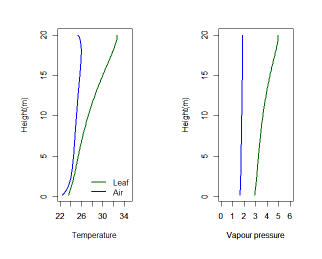

In the example above, ground surface temperature is held fixed and heat storage is only estimated rather than calculated explicitly. In the next section, we show how both of these terms can be solved directly.

## Ground heat storage
Analogous to our canopy example above, in calculating the rate of heat storage in the ground it is useful to mentally divide the soil profile into a number of vertical layers and calculate the heat flow and storage within each layer. What matters then is both the thermal conductivity of the soil and its heat capacity.

The thermal conductivity of the soil depends on its physical properties, namely the quartz, mineral and organic content of the soil. These are assumed to be static properties and depend on soil type. The inbuilt table `soilparams` in the `micropoint` package is a look-up table for deriving these parameters for a given soil type, and is used by some of the functions we showcase later. An important point, however, is that it is also dependent on the fraction of soil water content, which is not fixed and must itself be modelled. We can demonstrate this dependence using the `thermalConductivity` function in the code below. Here the volume fraction of quartz and minerals (Vq and Vm respectively) and the mass fraction of clay (Mc) typical of clay loam are provided as inputs. The temperature and pressure inputs partially determine conductivity in the air space, and temperature input is also used to check whether the water is in the form of ice.

```{r eval=FALSE}
Vw <- seq(0.08, 0.4, length.out = 100) # volumetric water fraction
k <- thermalConductivity(Vq = 0.06,
                         Vm = 0.509,
                         Vo = 0.02,
                         Vw,
                         Mc = 0.5422,
                         Tc = 15,
                         pk = 101.3)

par(mfrow = c(1, 1))
plot(k ~ Vw, type = "l", lwd = 2, col = "blue",
     xlab = expression("Volumetric water fraction (m"^3 * " m"^-3 * ")"),
     ylab = expression("Thermal conductivity (W m"^-1 * " K"^-1 * ")"))
```
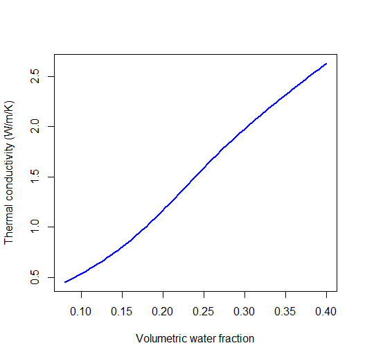

Likewise the soil heat capacity as dependence on soil physical properties:

```{r eval=FALSE}
Ch <- heatCapacity(Vq = 0.06, # volumetric quartz fraction
                   Vm = 0.509, # volumetric mineral fraction
                   Vo = 0.02, # volumetric organic fraction
                   Vw, # volumetric water fraction
                   Tc = 15, # temperature (°C)
                   pk = 101.3) / 1e6 # volumetric heat capacity (MJ m^-3 K^-1)

plot(Ch ~ Vw, type = "l", lwd = 2, col = "red",
     xlab = expression("Volumetric water fraction (m"^3 * " m"^-3 * ")"),
     ylab = expression("Volumetric heat capacity (MJ m"^-3 * " K"^-1 * ")"))
```
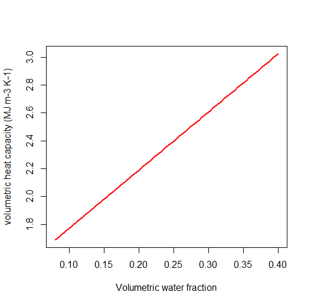

### Simple estimates
The rate of heat storage in the ground is one of the most difficult components of the energy balance to calculate explicitly, so we first present a simplified model before introducing a full formulation. Here, the soil is assumed to be infinitely deep with uniform thermal properties, and the surface temperature is approximated as a sinusoidal cycle. Under these assumptions, ground heat flux is also sinusoidal, but phase-shifted by 3 hours and scaled according to the amplitude of surface temperature, the soil’s thermal properties, and the damping depth, which determines how far temperature fluctuations penetrate into the soil.

In the code below, we use `solve_wholecanopy` to estimate the temperature of a sparsely vegetated surface, assuming this approximates ground surface temperature. We initially set the heat storage term (G) to zero, then iteratively update it and pass it back to `solve_wholecanopy` on each step. The effect of including `G` is shown in the plot. The first iteration (with `G = 0`) is shown in red. As the model iterates, intermediate solutions are plotted as semi-transparent lines transitioning from red to blue, and the final converged solution is shown in blue. Including `G` shifts the temperature cycle slightly later in the day and reduces its amplitude.

```{r eval=FALSE}
weather <- micropoint::climdata
tme <- as.POSIXlt(weather$obs_time, tz = "UTC")
sel <- which(tme$mon + 1 == 6 &
             tme$mday == 21) # select hours of 21 June
weather <- weather[sel,]

groundp <- micropoint::groundparams # ground parameters

vegp <- createplant_inputs("C3") # vegetation parameters for C3 grass
vegp$h <- 0.05 # vegetation height (m)
vegp$pai <- 0.02 # plant area index

Ca <- micropoint::Cafromyear(2017) # atmospheric CO2 concentration (ppm)

# -------------------------- Initialise variables ------------------------- #
G <- rep(0, 24) # ground heat flux (W m^-2)
error <- 1e99 # difference from previous iteration
Told <- 0 # temperature in previous iteration
itr <- 1 # iteration counter

cols <- adjustcolor(colorRampPalette(c("red", "blue"))(12),
                    alpha.f = 0.25)

tt <- 0:23 # hours of day
om <- 2 * pi / 24 # angular frequency

while (error > 1e-3) {
   # ------------------------ Cycle through each hour --------------------- #
   Ts <- 0 # initialise canopy temperature

   for (hr in 1:24) {
      # ---------------------- Run canopy solver -------------------------- #
      can <- solve_wholecanopy(weather, vegp, groundp,
                               hr,
                               lat = 49.96807,
                               long = -5.215668,
                               zref = 2,
                               G[hr],
                               theta = 0.3,
                               soilrh = 0.85,
                               Ca)
      Ts[hr] <- can$tcanopy # canopy temperature
   }

   # Plot diurnal temperature on each iteration
   if (itr == 1) {
     plot(Ts ~ tt, type = "l", col = "red",
          ylim = c(5, 55),
          xlab = "", ylab = "",
          lwd = 2)
   } else {
     plot(Ts ~ tt, type = "l", col = cols[itr],
          ylim = c(5, 55),
          xlab = "", ylab = "",
          lwd = 2)
   }
   par(new = TRUE)

   # ----------- Calculate decimal hour of peak temperature -------------- #
   m <- lm(Ts ~ sin(om * tt) + cos(om * tt))
   hrmx <- as.numeric(((pi / 2 -
             atan2(coef(m)[3], coef(m)[2])) / om) %% 24)

   # ------------------------ Calculate ground flux ----------------------- #
   A0 <- (max(Ts) - min(Ts)) / 2 # amplitude of temperature cycle

   k <- thermalConductivity(Vq = 0.06, # volumetric quartz fraction
                            Vm = 0.509, # volumetric mineral fraction
                            Vo = 0.02, # volumetric organic fraction
                            Vw = 0.3, # volumetric water fraction
                            Mc = 0.5422, # clay mass fraction
                            Tc = Ts, # temperature (°C)
                            pk = weather$pres)

   Ch <- heatCapacity(Vq = 0.06, # volumetric quartz fraction
                      Vm = 0.509, # volumetric mineral fraction
                      Vo = 0.02, # volumetric organic fraction
                      Vw = 0.3, # volumetric water fraction
                      Tc = 15, # temperature (°C)
                      pk = 101.3)

   ka <- k / Ch # thermal diffusivity
   DampDepth <- sqrt(2 * ka * 3600 / om) # damping depth (m)

   # Compute ground heat flux
   G <- sqrt(2) * A0 *
        sin(om * (tt - hrmx) + 3 * pi / 4) / DampDepth

   error <- max(abs(Ts - Told)) # convergence error
   Told <- Ts
   itr <- itr + 1

   if (itr > 12) itr <- 12 # ensure colours plot correctly
}

# ---------------------- Plot final converged temperature ----------------- #
plot(Ts ~ tt, type = "l", col = "blue",
     ylim = c(5, 55),
     xlab = "Hour",
     ylab = expression("Temperature (" * degree * "C)"),
     lwd = 2)
```
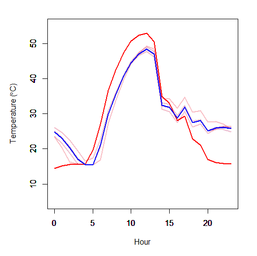
   
The damping depth also provides a route to computing sub-surface temperatures.
In the code below, we derive these for depths of 5 cm and 20 cm respectively

```{r eval=FALSE}
# Assumes code above already run
Tav <- mean(Ts) # average temperature (°C)
A0 <- (max(Ts) - min(Ts)) / 2 # amplitude of cycle

# ---------------- Temperatures at 5 cm depth ---------------------------- #
z <- -0.05 # depth below surface (m)
Tz5 <- Tav + A0 * exp(z / DampDepth) *
       sin(om * (tt - hrmx) + pi / 2 + z / DampDepth)

# ---------------- Temperatures at 20 cm depth --------------------------- #
z <- -0.2 # depth below surface (m)
Tz20 <- Tav + A0 * exp(z / DampDepth) *
        sin(om * (tt - hrmx) + pi / 2 + z / DampDepth)

# ----------------------------- Plot results ----------------------------- #
# Actual surface temperature
plot(Ts ~ tt, type = "l", col = "red",
     ylim = c(5, 55),
     xlab = "Hour",
     ylab = expression("Temperature (" * degree * "C)"),
     lwd = 2)
par(new = TRUE)
# Assumed sinusoidal cycle
Tz0 <- Tav + A0 * sin(om * (tt - hrmx) + pi / 2)
plot(Tz0 ~ tt, type = "l", col = "red",
     ylim = c(5, 55),
     xlab = "", ylab = "",
     lwd = 2, lty = 2)
par(new = TRUE)
# 5 cm depth
plot(Tz5 ~ tt, type = "l",
     ylim = c(5, 55),
     xlab = "", ylab = "",
     lwd = 2)

par(new = TRUE)
# 20 cm depth
plot(Tz20 ~ tt, type = "l", col = "blue",
     ylim = c(5, 55),
     xlab = "", ylab = "",
     lwd = 2)
legend("topleft",
       legend = c("Surface temperature",
                  "Sinusoidal approximation",
                  "5 cm depth",
                  "20 cm depth"),
       col = c("red", "red", "black", "blue"),
       lty = c(1, 2, 1, 1),
       lwd = 2,
       bty = "n")
```
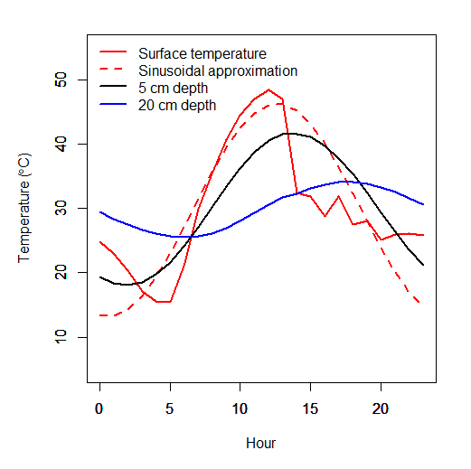

While the procedure above provides a reasonable way to estimate ground heat storage and subsurface temperatures, it relies on assumptions that are clearly limiting. In particular, assuming a sinusoidal surface temperature cycle is unrealistic, and the assumption of vertically uniform thermal properties is problematic given their dependence on soil water content. We therefore turn to a more comprehensive model.

### Soil temperature model
Here we divide the soil into multiple layers. The surface layer has a non-zero energy balance determined by the absorbed radiation and the exchange of longwave radiation, sensible and latent heat with the air above. When this balance is positive the surface warms, and when it is negative it cools. Heat is then conducted between adjacent soil layers at a rate determined by the thermal conductivity and the temperature gradient between them, and the resulting temperature change in each layer depends on its heat capacity.

At each timestep the temperature profile is updated by solving the discretised heat equation across all layers simultaneously using a tridiagonal matrix formulation. This yields a midpoint (partly implicit) solution that is numerically stable over typical timestep lengths. The calculation is embedded within an iteration because the surface heat flux depends on the surface temperature, which is itself part of the solution. A fixed temperature is imposed at the lower boundary, and the solution is constrained to avoid non-physical oscillations in the vertical temperature profile.

To set up the model, we first use the function `createsoilplist`. The user specifies the soil type, the number of layers, and the total depth of the soil profile, extending to a lower boundary where temperatures are assumed to be stable. The function then constructs a geometrically increasing sequence of layer thicknesses, so that deeper layers are progressively thicker, improving numerical stability. For each layer, typical values are assigned for bulk density, heat capacity, and the fractions of quartz, mineral, clay, and organic matter.  The user can optionally apply a scaling factor to control the vertical distribution of organic matter near the surface. By default, bulk density is assumed to increase slightly with depth. Once created, any of the default parameters can be modified byu the user. 

Available soil types are `Sand`, `Loamy sand`, `Sandy loam`, `Loam`, `Silt loam`, `Sandy clay loam`, `Clay loam`, `Silty clay loam`, `Sandy clay`, `Silty clay` and `Clay`. In the example below the default parameters for `clay loam` and leave `surface_organicmu` at its default value of 3, meaning the surface layer is given three times as much soil organic material as the average for the profile. 

```{r eval=FALSE}
# -------------- Generate list of soil model parameters --------------- # 
soilp <- createsoilplist(soiltype = "Clay loam",
                         nlayers = 15, # number of soil layers
                         totalDepth = 2, # total soil depth (m)
                         slope = 0, # slope (degrees)
                         aspect = 180, # aspect (degrees)
                         surface_organicmu = 3, # surface organic matter depth
                         FreeDrain = TRUE) # free drainage lower boundary
```

The final input, `FreeDrain`, is used by the soil water model described later. Once the soil parameters have been generated, the model is initialised using InitSoilheatmod as follows:

```{r eval=FALSE}
# Initial soil temperature sequence: surface to lower boundary layer
Te <- seq(18, 11, length.out = 16)
theta <- rep(0.3, 16) # volumetric soil water fraction
soilheat <- InitSoilheatmod(soilp, Te, theta)
```

This function creates a list containing the state variables required to run the model: initial soil temperature and water content for each layer, plus a fixed temperature at the lower boundary. A sensible choice for this boundary condition is the mean annual temperature. Each call to the soil heat model advances the system by one timestep and returns an updated object of the same form, with revised soil temperatures. The model also returns an estimate of the rate of ground heat storage.

We are now ready to run the soil heat model. In addition to the soil parameters and state variables, the model requires the radiation absorbed at the surface, air temperature, relative humidity, and atmospheric pressure at a reference height, along with the resistance to heat transfer between the soil surface and that reference height (zref).

In the example below, we run the model for short grass over 10 days in June. The function `solve_wholecanopy` is used to estimate the radiation absorbed by the soil surface, while `groundresistance` provides the resistance to heat transfer. The soil heat model (`SoilHeatModel`) is then applied at each hourly timestep.

We store the surface temperature and compute the rate of ground heat storage. Because `solve_wholecanopy` requires an estimate of ground heat storage as an input, the calculations are embedded within an iterative loop. The final code block plots the resulting time series, illustrating the diurnal cycle in surface temperature and ground heat flux.

```{r eval=FALSE}
# ---------------- Create driving data from inbuilt datasets -------------- #
weather <- micropoint::climdata
groundp <- micropoint::groundparams

vegp <- createplant_inputs("C3")
vegp$h <- 0.1 # vegetation height (m)
vegp$pai <- 0.15 # total plant area index

boundaryT <- mean(weather$temp) # lower boundary temperature (°C)

# ---------------- Select data for first 10 days in June ----------------- #
tme <- as.POSIXlt(weather$obs_time, tz = "UTC")

sel <- which(tme$mon + 1 == 6 &
             tme$mday < 11)

weather <- weather[sel,]

# ---------------- Create parameters for soil heat model ----------------- #
soilp <- createsoilplist(soiltype = "Clay loam",
                         nlayers = 15, # number of soil layers
                         totalDepth = 2, # total soil depth (m)
                         slope = 0, # slope (degrees)
                         aspect = 180, # aspect (degrees)
                         surface_organicmu = 3, # surface organic matter depth
                         FreeDrain = TRUE) # free drainage lower boundary

Te <- seq(weather$temp[1],
          boundaryT,
          length.out = 16) # initial temperature profile (°C)

theta <- rep(0.3, 16) # volumetric water content

soilheat <- InitSoilheatmod(soilp, Te, theta) # initialise soil heat model

# -------------------------- Initialise variables ------------------------- #
error <- 1e99 # difference between current and previous G
G <- 0 # ground heat flux (W m^-2)

Tsurface <- 0 # ground surface temperature (°C)
Gflux <- rep(G, 24) # ground heat flux for each timestep

for (hr in 1:240) {

  while (error > 1e-4) {

     # ---------------------- Run canopy model ---------------------------- #
     can <- solve_wholecanopy(weather, vegp, groundp,
                              hr,
                              49.96807,
                              -5.215668,
                              zref = 2,
                              G,
                              0.3,
                              0.8)

     # -------- Compute resistance from ground surface to zref ----------- #
     rHg <- groundresistance(vegp$h,
                             vegp$pai,
                             can$uf,
                             can$LL,
                             can$psih,
                             zref = 2)

     # ------------------------- Run soil heat model --------------------- #
     soilheat <- SoilHeatModel(soilheat,
                               soilp,
                               Rabs = can$Rabs,
                               Tref = weather$temp[hr],
                               relhum = weather$relhum[hr],
                               atmPressure = weather$pres[hr],
                               rHg)

     error <- abs(G - soilheat$Gflux) # convergence error
     G <- soilheat$Gflux
  }

  Gflux[hr] <- G
  Tsurface[hr] <- soilheat$Te[1]

  soilheat$oldTe <- soilheat$Te # update model state

  error <- 1e99 # reset convergence criterion
}

# ----------------------------- Plot time series -------------------------- #
par(mfrow = c(2, 2))

tmec <- as.POSIXct(tme[sel], tz = "UTC")

# Soil surface temperature
plot(Tsurface ~ tmec, type = "l", lwd = 2, col = "red",
     xlab = "Date",
     ylab = expression("Temperature (" * degree * "C)"))

# Ground heat flux
plot(Gflux ~ tmec, type = "l", lwd = 2, col = "blue",
     xlab = "Date",
     ylab = expression("Ground heat flux (W " * m^-2 * ")"))

# ---------------- Plot normalised diurnal cycle ------------------------- #

# Values are scaled between each day's minimum and maximum
# to emphasise differences in diurnal shape among days

plotdailycycle <- function(v, clr) {

  # Convert hourly vector into day × hour matrix
  vd <- matrix(v, ncol = 24, byrow = TRUE)

  # Daily minima and maxima
  vmn <- rep(apply(vd, 1, min), each = 24)
  vmx <- rep(apply(vd, 1, max), each = 24)

  # Scale values between 0 and 1
  vfrac <- (v - vmn) / (vmx - vmn)

  # Rebuild day × hour matrix
  vdfrac <- matrix(vfrac, ncol = 24, byrow = TRUE)

  for (i in 1:dim(vdfrac)[1]) {

    # Plot each daily cycle
    v24 <- vdfrac[i,]

    if (i < dim(vdfrac)[1]) {

      plot(v24, type = "l",
           ylim = c(0, 1),
           col = clr,
           xlab = "", ylab = "")

      par(new = TRUE)

    } else {

      plot(v24, type = "l",
           ylim = c(0, 1),
           col = clr,
           xlab = "Hour",
           ylab = "Normalised diurnal cycle")
    }
  }
}

# Plot daily cycles for surface temperature and ground heat flux
plotdailycycle(Tsurface, rgb(1, 0, 0, 0.5))
plotdailycycle(Gflux, rgb(0, 0, 1, 0.5))
```
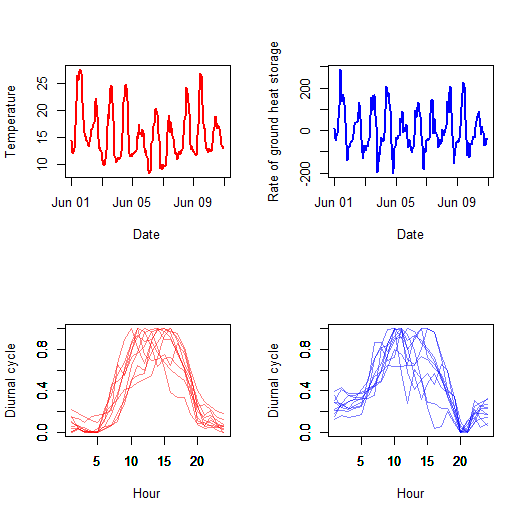

### Soil water model
Soil hydrological processes are typically represented by dividing the soil into a set of vertical layers, analogous to the heat model. Evaporation removes water from the surface, while transpiration extracts water throughout the profile according to root distribution. At the same time, water is redistributed within the soil, with fluxes occurring between layers. However, the gradient that drives these fluxes is not the gradient in volumetric water content $\small \theta$, but the gradient in soil water potential $\small \psi_w$, defined as the pressure of water relative to atmospheric pressure (and therefore negative in unsaturated soils).

A relationship between $\small \theta$ and $\small \psi_w$ is therefore required. This relationship is highly nonlinear and soil-specific, and is typically described using an empirical function. Two widely used formulations are the Campbell and van Genuchten models. The Campbell model represents the relationship as a simple power law, defined by an air-entry potential ($\small \psi_e$) and a shape parameter $\small b$; air-entry potential is the potential at which air first begins to enter the largest soil pores as the soil drains. Below this point, water content declines approximately as a power function of $\small \psi_w$. The van Genuchten model uses a more flexible functional form, with additional parameters that allow it to represent the observed relationships across a wider range of conditions. Both approaches define a continuous mapping between one measure and the other, allowing models formulated in terms of $\small \psi_w$ to be solved while retaining $\small \theta$ for mass balance and interpretation.

In the code below, we compare the Campbell and van Genuchten formulations for a clay loam soil. Each model is used to compute the corresponding water potential across a range of water contents, and the resulting retention curves are plotted. This illustrates how the two approaches differ in the shape of the curve linking moisture status to pressure, particularly across the drying range.

```{r eval=FALSE}
# ------------ Comparison of Campbell and Van Genuchten --------------------- #
Campbell_params <- Campbellparams("Clay loam")
VG_params <- VGparams("Clay loam")

theta <- seq(VG_params$Smin + 1e-3,
             VG_params$Smax,
             length.out = 100)

psiw1 <- with(Campbell_params,
              PsiFromtheta(theta,
                           psie,
                           b,
                           Smax,
                           MPa = FALSE))

psiw2 <- with(VG_params,
              PsiFromthetaVG(theta,
                             Smin,
                             Smax,
                             psie,
                             alpha,
                             n))

# ----------------------------- Plot results ------------------------------ #
par(mar = c(5, 5, 2, 2),
    mfrow = c(1, 1))
plot(theta, log10(-psiw1),
     type = "l",
     lwd = 2,
     ylim = c(log10(1e9), log10(1.2)),
     yaxt = "n",
     xlab = expression(theta ~ "(m"^3 * " m"^-3 * ")"),
     ylab = expression(psi[w] ~ "(Pa)"),
     cex.lab = 2,
     cex.axis = 2)
lines(theta, log10(-psiw2),
      col = "red",
      lwd = 2)
exps <- 0:9
axis(2,
     at = log10(10^exps),
     cex.axis = 2,
     labels = paste0("-", 10^exps))
legend("bottomright",
       legend = c("Campbell", "van Genuchten"),
       col = c("black", "red"),
       lwd = 2,
       bty = "n",
       cex = 1.5)
```
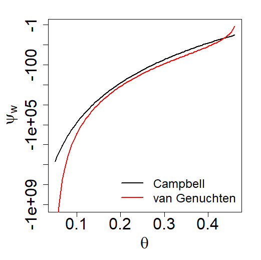

You can see that the two approaches match closely in the mid-range of theta, but differ when the soil is very wet or very dry. 

In the code below, we illustrate how the relationship differs between contrasting soil types by comparing clay and sand using the van Genuchten formulation. Water potential is computed across a common range of water contents for each soil, and the resulting curves are plotted. The comparison shows that, at the same water content, sand has a much higher (less negative) potential than clay, meaning water is much less strongly retained in sand than in clay, owing to its larger pore sizes.

```{r eval=FALSE}
VG_params1 <- VGparams("Clay")
VG_params2 <- VGparams("Sand")

theta <- seq(0.07, 0.37, length.out = 100) # volumetric water content

psiw1 <- with(VG_params1,
              PsiFromthetaVG(theta,
                             Smin,
                             Smax,
                             psie,
                             alpha,
                             n))

psiw2 <- with(VG_params2,
              PsiFromthetaVG(theta,
                             Smin,
                             Smax,
                             psie,
                             alpha,
                             n))

# ----------------------------- Plot results ------------------------------ #
par(mar = c(5, 5, 2, 2))
plot(theta, log10(-psiw1),
     type = "l",
     lwd = 2,
     ylim = c(log10(1e12), log10(1.2)),
     yaxt = "n",
     xlab = expression(theta ~ "(m"^3 * " m"^-3 * ")"),
     ylab = expression(psi[w] ~ "(Pa)"),
     cex.lab = 2,
     cex.axis = 2)
lines(theta, log10(-psiw2),
      col = "red",
      lwd = 2)
exps <- 0:12
axis(2,
     at = log10(10^exps),
     cex.axis = 2,
     labels = paste0("-", 10^exps))
legend("bottomright",
       legend = c("Clay", "Sand"),
       col = c("black", "red"),
       lwd = 2,
       bty = "n",
       cex = 1.5)
```
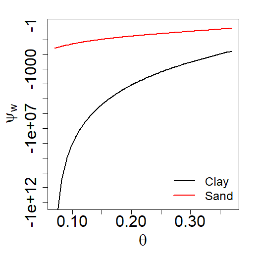

Hydraulic conductivity determines how readily water can pass through soil. Unlike saturated conductivity, which is a fixed property for a given soil, unsaturated hydraulic conductivity declines sharply as the soil dries. This occurs because water-filled pathways through the pore network become progressively reduced, so the soil becomes much less able to transmit water. Hydraulic conductivity is therefore a key control on the rate of water redistribution through the profile.

In the code below, hydraulic conductivity is calculated across a range of water contents using the Campbell and van Genuchten formulations for the same soil. The resulting curves show how conductivity declines as the soil dries, and allow comparison of the different functional forms implied by the two models. Note that as in the example above, a long-linear scale is used to represent hydrualic conductivity. 

```{r eval=FALSE}
Campbell_params <- Campbellparams("Clay loam")
VG_params <- VGparams("Clay loam")

Ks1 <- with(Campbell_params,
            hydraulicConductivityFromTheta(theta,
                                           b, # Campbell shape parameter
                                           Smax, # volumetric water content at saturation
                                           Ksat)) # saturated hydraulic conductivity

Ks2 <- with(VG_params,
            hydraulicConductivityFromThetaVG(theta,
                                             Smin, # residual water content
                                             Smax, # volumetric water content at saturation
                                             psie, # air-entry water potential
                                             alpha, # van Genuchten scaling parameter
                                             n, # van Genuchten shape parameter
                                             Ksat)) # saturated hydraulic conductivity

# ----------------------------- Plot results ------------------------------ #
par(mar = c(5, 5, 2, 2))
plot(theta, Ks1,
     log = "y",
     type = "l",
     lwd = 2,
     ylim = c(1e-20, 1e-4),
     xlab = expression(theta ~ "(m"^3 * " m"^-3 * ")"),
     ylab = expression("Hydraulic conductivity (m s"^-1 * ")"),
     cex.axis = 2,
     cex.lab = 2)
lines(theta, Ks2,
      col = "red",
      lwd = 2)
legend("bottomright",
       legend = c("Campbell", "van Genuchten"),
       col = c("black", "red"),
       lwd = 2,
       bty = "n",
       cex = 1.5)
```
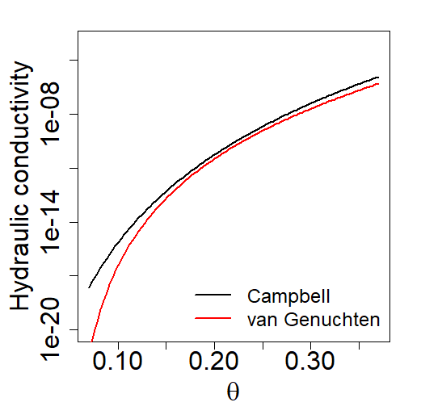

With these relationships defined, we can formulate the soil water model. As with the heat model, the soil is represented as a set of vertical layers, and fluxes between layers are calculated based on differences between them. However, unlike heat transfer, the governing equations for water are strongly nonlinear, primarily because hydraulic conductivity changes by many orders of magnitude with moisture status. This means the system cannot be solved directly. Instead, at each time step the model uses a Newton–Raphson method, which improves an initial guess by estimating how much each variable must change for the equations to be satisfied. This requires knowing how the fluxes respond to small changes in the state variables. For this reason, the Campbell model is used here, as its simple form makes these sensitivities straightforward to evaluate, allowing the solver to be implemented efficiently.

As with any vertical flow model, the behaviour at the base of the soil profile must be specified. This lower boundary condition determines whether water can leave the system at depth or is effectively constrained from doing so. In this model, the boundary condition is controlled by the `FreeDrain` argument in the soil parameter list (created using `createsoilplist`). If `FreeDrain = TRUE`, water is allowed to drain freely out of the bottom of the profile under gravity, representing a deep, well-drained soil. If `FreeDrain = FALSE`, the lower boundary is treated as saturated, equivalent to the presence of a water table at depth, which limits drainage from the deepest layer.

The soil water model is run at each time step using the function `SoilWaterModel`. The function solves the balance between four processes. Water can enter the soil from rainfall, be lost from the surface by evaporation, be extracted from different depths by roots, and move between adjacent soil layers. The first three act as sources or sinks, while the last redistributes water internally through the profile.

In the code below we begin by setting up the inputs and initial conditions for the model. Weather and ground parameters are taken from the built-in datasets, and simple vegetation characteristics are defined. The simulation is then restricted to the first 10 days of June. A soil profile is created with a specified number of layers and depth, and initial profiles of temperature and water content are assigned. These are used to initialise the soil heat and soil water model states and we set `FreeDrain = TRUE`. A small indexing step identifies which layer corresponds to approximately 10 cm depth so that values at this depth can be extracted later.

The model is then advanced in time using an hourly loop. Within each hour, a second loop iterates until the surface energy balance has stabilised. This inner loop ensures that the canopy, soil heat, and soil water components are consistent with one another before moving to the next time step. Within each iteration, the canopy model is solved first. This provides canopy temperature, radiation absorption, and the resistances that control exchanges with the atmosphere. These outputs are then used to calculate the resistance between the soil surface and the reference height, which determines how efficiently heat and water vapour are transferred away from the surface. The soil heat model is then updated using these conditions. This produces a new temperature profile and an updated ground heat flux. The difference between successive estimates of ground heat flux is used to assess convergence, and the loop continues until this difference becomes small. Once the energy balance is consistent, the code computes the water fluxes that drive the soil water model. Transpiration is calculated from the canopy state using vapour pressure gradients and resistances, and is set to zero when stomatal resistance is very high. Evaporation is calculated separately from the top soil layer, using its current water content and temperature. Together with precipitation from the weather data, these define the gains and losses of water for that time step.

These fluxes are then passed to the soil water model, along with the current soil state. The soil temperature profile is also provided so that temperature-dependent processes are evaluated consistently. The soil water model is then run, updating water potential and water content in each layer by balancing evaporation, transpiration, precipitation, and vertical redistribution. After the soil water model has updated the profile, the new water contents are passed back to the heat model. This ensures that the thermal calculations reflect the current water status of the soil, maintaining the coupling between heat and water.

Once the inner loop has converged, selected outputs are stored for that hour. In this example, temperature and water content are recorded at the surface and at approximately 10 cm depth. The current state is then saved as the previous state, so that the next time step starts from the updated conditions. After all time steps have been completed, the stored values are plotted. The results show how temperature and water content vary through time at the surface and at depth, with surface conditions responding more rapidly to atmospheric forcing and deeper layers showing slower, damped responses.

```{r eval=FALSE}
# ---------------- Load example forcing and parameter datasets ------------ #
weather <- micropoint::climdata # meteorological forcing data
groundp <- micropoint::groundparams # ground surface parameters

vegp <- createplant_inputs("C3") # vegetation parameters for C3 grass
vegp$h <- 0.1 # canopy height (m)
vegp$pai <- 0.15 # plant area index

boundaryT <- mean(weather$temp) # lower soil boundary temperature (°C)

# ---------------- Select first 10 days of June -------------------------- #
tme <- as.POSIXlt(weather$obs_time, tz = "UTC")
sel <- which(tme$mon + 1 == 6 &
             tme$mday < 11)
weather <- weather[sel,]

# ---------------------- Create soil parameter set ----------------------- #
soilp <- createsoilplist(soiltype = "Clay loam",
                         nlayers = 15, # number of soil layers
                         totalDepth = 2, # total soil depth (m)
                         slope = 0, # slope (degrees)
                         aspect = 180, # aspect (degrees)
                         surface_organicmu = 1, # surface organic matter depth
                         FreeDrain = TRUE) # free drainage lower boundary

n <- length(soilp$b) # number of soil layers

# ---------------------- Initialise soil profiles ------------------------ #
Te <- seq(weather$temp[1],
          boundaryT,
          length.out = n) # initial temperature profile (°C)
theta <- seq(0.2,
             soilp$Smax[n],
             length.out = n) # initial soil water profile
soilheat <- InitSoilheatmod(soilp,
                            Te,
                            theta) # initialise soil heat model
soilwater <- InitSoilwatermod(soilp,
                              soilheat,
                              rootskew = vegp$rootskew) # initialise soil water model

# Identify layer closest to 10 cm depth
nd <- which(soilheat$z[1:10] < 0.1)
nd <- nd[length(nd)] + 1

# ------------------------- Initialise outputs --------------------------- #
Tsurface <- T10cm <- theta_surface <- theta_10cm <- Gflux <- er <- rep(NA, 240)
G <- 0 # initial ground heat flux estimate
error <- 1e99 # convergence criterion

# --------------------------- Main simulation loop ----------------------- #
for (hr in 1:240) {
  itr <- 1
  # Iteratively solve canopy, soil heat, and soil water balance
  while (error > 1e-2 && itr < 20) {
    # ---------------------- Solve canopy energy balance ---------------- #
    can <- solve_wholecanopy(weather,
                             vegp,
                             groundp,
                             hr,
                             49.96807,
                             -5.215668,
                             zref = 2,
                             G,
                             0.3,
                             0.8)

    # -------- Aerodynamic resistance between soil and atmosphere ------- #
    rHg <- groundresistance(vegp$h,
                            vegp$pai,
                            can$uf,
                            can$LL,
                            can$psih,
                            zref = 2)

    # ----------------------- Solve soil heat transport ----------------- #
    soilheat <- SoilHeatModel(soilheat,
                              soilp,
                              Rabs = can$Rabs, # absorbed radiation (W m^-2)
                              Tref = weather$temp[hr], # air temperature (°C)
                              relhum = weather$relhum[hr], # relative humidity (%)
                              atmPressure = weather$pres[hr], # pressure (kPa)
                              rHg)

    error <- abs(G - soilheat$Gflux) # convergence error
    G <- soilheat$Gflux
    
    # ----------------------- Compute canopy transpiration -------------- #
    Tk <- can$tcanopy + 273.15 # canopy temperature (K)
    if (can$rSl > 1e9) {
      # Stomata effectively closed
      Transp <- 0
    } else {
      # Total vapour resistance
      rV <- can$rHa + can$rSl

      # Saturation vapour pressure inside canopy
      es <- satvap(can$tcanopy) * 1000

      # Atmospheric vapour pressure
      ea <- satvap(weather$temp[hr]) *
            (weather$relhum[hr] / 100) * 1000

      # Convert vapour flux to mm h^-1
      Transp <- (0.018015 / (8.314 * Tk * rV)) *
                (es - ea) * 3600

      # Prevent negative transpiration
      Transp[Transp < 0] <- 0
    }

    # ----------------------- Compute bare soil evaporation ------------ #
    theta_av <- (soilwater$theta[1] +
                 soilwater$oldtheta[1]) / 2 # average surface water content
    Tc_av <- (soilheat$Te[1] +
              soilheat$oldTe[1]) / 2 # average surface temperature

    Evapmmhr <- evaporation_flux(theta_av,
                                 Tc_av,
                                 weather$temp[hr],
                                 weather$relhum[hr],
                                 rHg,
                                 soilp$psie[1], # air-entry water potential
                                 soilp$b[1], # Campbell shape parameter
                                 soilp$Smax[1], # saturation water content
                                 3600) # timestep (s)

    # ----------------------- Assemble forcing data --------------------- #
    climdata <- list(Tair = weather$temp[hr], # air temperature (°C)
                     relhum = weather$relhum[hr], # relative humidity (%)
                     rHa = rHg, # aerodynamic resistance (s m^-1)
                     precip = weather$precip[hr], # precipitation (mm h^-1)
                     Et = Transp, # transpiration (mm h^-1)
                     Evapmmhr = Evapmmhr) # evaporation (mm h^-1)

    # ----------------------- Solve soil water movement ----------------- #
    soilwater$Tc <- soilheat$Te
    soilwater$oldTc <- soilheat$oldTe

    soilwater <- SoilWaterModel(soilwater,
                                soilp,
                                climdata,
                                pTAW = vegp$pTAW, # fraction extractable water
                                maxNrIterations = 20)

    # Update thermal properties using new soil moisture
    soilheat$wc <- soilwater$theta
    itr <- itr + 1
  }

  # ---------------------------- Store outputs -------------------------- #
  Gflux[hr] <- G
  Tsurface[hr] <- soilheat$Te[1]
  T10cm[hr] <- soilheat$Te[nd]

  theta_surface[hr] <- soilwater$theta[1]
  theta_10cm[hr] <- soilwater$theta[nd]

  soilheat$oldTe <- soilheat$Te
  soilwater$oldvapor <- soilwater$vapor
  soilwater$oldtheta <- soilwater$theta

  er[hr] <- error
  error <- 1e99
}

# --------------------------- Plot time series --------------------------- #
par(mfrow = c(2, 1))
tmec <- as.POSIXct(tme[sel], tz = "UTC")
# Soil temperature time series
plot(Tsurface ~ tmec, type = "l",
     lwd = 2,
     col = "red",
     ylim = c(8, 50),
     xlab = "Date",
     ylab = expression("Temperature (" * degree * "C)"))

par(new = TRUE)
plot(T10cm ~ tmec, type = "l",
     lwd = 2,
     col = "blue",
     ylim = c(8, 50),
     xlab = "",
     ylab = "")
legend("topright",
       legend = c("Surface", "10 cm"),
       col = c("red", "blue"),
       lwd = 2,
       bty = "n")
# Soil moisture time series
plot(theta_surface ~ tmec, type = "l",
     lwd = 2,
     col = "red",
     ylim = c(0, 0.5),
     xlab = "Date",
     ylab = expression(theta ~ "(m"^3 * " m"^-3 * ")"))
par(new = TRUE)
plot(theta_10cm ~ tmec, type = "l",
     lwd = 2,
     col = "blue",
     ylim = c(0, 0.5),
     xlab = "",
     ylab = "")
legend("bottomright",
       legend = c("Surface", "10 cm"),
       col = c("red", "blue"),
       lwd = 2,
       bty = "n")
```
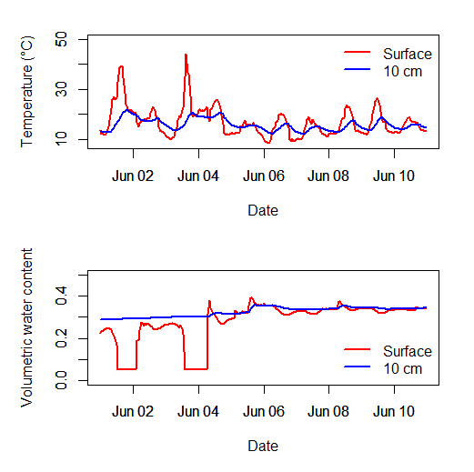

The resulting time series show contrasting behaviour between the surface and deeper soil layers. Surface temperature responds rapidly to atmospheric forcing, with large diurnal fluctuations, while temperature at 10 cm depth is more buffered and varies more slowly. Periods when the surface soil is wet show noticeably reduced temperature variability, reflecting the strong buffering effect of higher water content on thermal properties. A similar pattern is evident for water content. The surface layer shows sharp declines associated with evaporation, followed by recovery during wetter periods, whereas the deeper layer remains comparatively stable. Once the surface becomes wet, it also tends to remain wet for some time, because hydraulic conductivity is much higher under these conditions, allowing water to be more readily supplied from below.

## Snow

### Snow energy balance
The principles of snow energy balance are broadly similar to those for other surfaces, but there are several important differences worth noting. On bare ground, the absorption of direct solar radiation depends strongly on the angle between the incoming radiation and the surface, and this can be calculated using slope and aspect. Snow surfaces, however, behave differently. At the scale relevant for energy exchange, snow is not a smooth plane but a collection of small, irregular facets created by grain structure, wind redistribution, and melt processes. This roughness reduces the directional dependence of radiation absorption, so snow behaves more like a near-Lambertian surface.

Snow surfaces are rough at small scales, so they do not behave like a single smooth plane. As a result, applying a full slope–aspect correction can exaggerate contrasts between sun-facing and shaded slopes. In practice, it is often better to dampen the slope correction rather than remove it entirely. In the package this can be done with `rossindex`, which returns a modified slope correction for direct radiation. Setting y = 0 gives the standard planar correction, while increasing y progressively reduces the influence of slope; y = 1 removes it entirely. A value around y = 0.7 is a reasonable compromise for snow in many applications. The effects of altering `y` are shown in the example below

```{r eval=FALSE}
# Create sun position object with fixed solar geometry
solp <- list(zen = rep(40, 100), # solar zenith angle (degrees)
             azi = rep(180, 100)) # solar azimuth angle (degrees)

# Slope facing the sun
slope <- 30 # slope angle (degrees)
aspect <- 180 # slope aspect (degrees)

# Vary y parameter
yvals <- seq(0, 1, length.out = 100)

# Compute solar index as function of y
si <- rossindex(solp,
                y = yvals, # leaf angle distribution parameter
                slope = slope,
                aspect = aspect)

# ----------------------------- Plot results ------------------------------ #
par(mfrow = c(1, 1))
plot(si ~ yvals, type = "l",
     lwd = 2,
     col = "red",
     xlab = "y parameter",
     ylab = "Solar index")
```
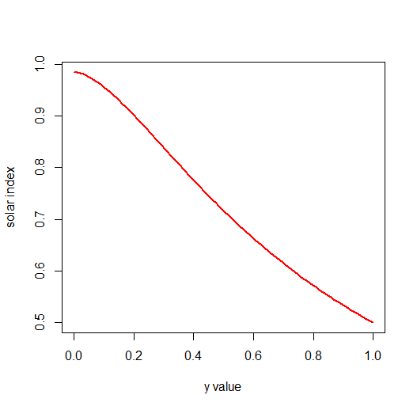

To calculate snow albedo, we use the `SnowAlbedo` function as in the example below

```{r eval=FALSE}
snowage <- seq(0, 365 * 24, length.out = 365) # age in hours
alb <- SnowAlbedo(snowage)
par(mfrow = c(1, 1))
plot(alb ~ snowage, type = "l",
     col = "blue",
     lwd = 2,
     xlab = "Snow age (hours)",
     ylab = "Albedo")
```
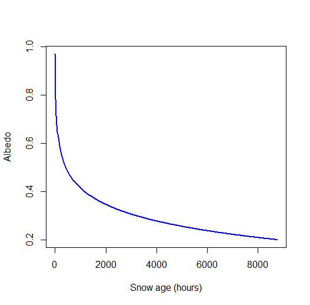

Two additional considerations are important. First, resistance to heat loss from the snow surface must account for the presence of a snowpack. This has two effects: (i) it reduces the distance between the snow surface and the reference height at which climate forcing variables are measured, and (ii) it decreases surface roughness due to the partial or complete burial of vegetation. These effects are represented using the SnowResistance function, as illustrated in the extended example below.

The second consideration is latent heat exchange. When the ground is frozen, plants cannot access water from the frozen soil, so stomatal conductance and transpiration are reduced. In contrast, the snow surface can freely evaporate or sublimate and, unlike soil evaporation, is not limited by soil water availability.

Resolving the full energy balance of the snowpack also requires accounting for heat storage. This is implemented analogously to the soil heat model described above. The snowpack is discretised into multiple layers and appended to the soil profile, such that heat exchange within snow layers, between snow and soil, and within the soil is solved as a single coupled system using the same tridiagonal solution scheme. Surface fluxes are applied at the top boundary, while a fixed temperature is imposed at depth, and layer-specific thermal properties are updated at each iteration. This coupled approach is implemented in the `SnowSoilHeatModel` function, which integrates the snow surface energy balance with the soil heat model and solves the combined system over each time step, as illustrated in the extended example below.

### Snow mass balance
To accommodate snow, we also need to track snow depth and snow water equivalent through time. This is handled using the SnowMassBalance function, which updates the snowpack at each time step by adding freshly fallen snow as a new surface layer and removing mass according to melt and phase-change processes.

Precipitation is partitioned into snow and rain based on air temperature. Snowfall is added to the top of the pack, while rainfall can induce melt when air temperatures are above freezing. Additional mass changes arise from sublimation or deposition at the surface, and from internal melt when snow layers exceed 0 °C. The snowpack can retain a limited amount of liquid water, with any excess draining to the underlying snow layer as throughfall. After these updates, layer densities and thicknesses are recalculated to maintain a physically consistent snow profile.

Conversion between snow water equivalent and snow depth requires an estimate of bulk snow density. This is calculated using the SnowDensParams and SnowDensFun functions, which parameterise snow densification as a function of snow depth and age for different snow environments, allowing the model to update both snow depth and density consistently through time.

In the extended example below, we illustrate how the snow and soil components are coupled within a simple hourly simulation. We begin by loading the example weather, ground and vegetation datasets, then modify the air temperature series to create conditions cold enough for sustained snow cover. For simplicity, vegetation is set to be short and sparse (and is later assumed to be entirely snow-covered), and the lower boundary condition for the soil heat model is taken as the mean air temperature over the full period. We then subset the forcing data to a single month and use these inputs to define the soil profile, including its hydraulic and thermal properties.

The soil heat and soil water models are then initialised, together with a snowpack of specified initial depth, age and temperature. The snowpack is represented as a set of layers, and the soil profile is treated in the same layered way, allowing the two to be solved as a coupled system. Empty vectors are also created to store diagnostic outputs such as snow depth, snow surface temperature, mean snow temperature and ground surface temperature through time.

The model is then run at an hourly time step. At each step, absorbed radiation is first calculated for the snow surface using incoming shortwave and longwave radiation together with a snow albedo estimated from the age of the surface snow layer. Aerodynamic resistance is then calculated with `SnowResistance`, taking account of the current snow depth and atmospheric stability corrections. These inputs are passed to `SnowSoilHeatModel`, which updates the coupled snow-soil temperature profile by solving conductive heat exchange through the snowpack and soil layers.

The updated snowpack then determines the water reaching the soil. Specifically, throughfall from the snow model is used as precipitation input to the soil water model, while evaporation and transpiration are set to zero here for simplicity. The soil water model is used to update soil moisture, and the resulting water contents are passed back to the soil heat model so that soil thermal properties remain consistent with moisture conditions.

Next, the full precipitation input is supplied to `SnowMassBalance`, which updates snow water equivalent, snow depth and liquid water storage within the snowpack. This step accounts for snowfall, rainfall, melt, sublimation, deposition and drainage, and recalculates snow layer density and thickness accordingly. Because snow density changes through time, the depth of the pack is not determined by snow water equivalent alone, but also by the evolving bulk density of the snow.

After each hourly update, key state variables are extracted and stored, including snow surface temperature, mean snow temperature, ground surface temperature and total snow depth. The example then updates the diabatic stability corrections used in the aerodynamic resistance calculation by estimating sensible heat flux and the Obukhov length from the current surface state. Finally, the snow layers are regularised where necessary so that the discretisation remains numerically well behaved as the pack deepens, compacts or melts.

To maintain numerical stability, the snowpack is periodically re-discretised using RegulariseSnowLayers. As snow accumulates, compacts, or melts, individual layers can become unrealistically thin or thick, which can degrade the performance of the heat solver. This function merges overly thin layers and splits overly thick ones, while conserving mass and maintaining consistent temperature and age profiles. After restructuring, snow density is recalculated from depth and age to ensure the layer configuration remains physically consistent.

For computational expedience, the snow–soil heat model, soil water model, snow mass balance, and diabatic stability corrections are applied sequentially at each time step, rather than being solved as a fully coupled iterative system. In contrast to the soil-only example above, where canopy and soil heat fluxes are iterated to convergence within each time step, each component here is updated once using the most recent state. A fully coupled solution would be relatively straightforward to implement, but would increase computational cost.

The final plots show the simulated evolution of snow depth and the corresponding temperature dynamics of the snow surface, the mean snowpack and the underlying ground surface over the course of the month.

```{r eval=FALSE}
# ---------------- Load example forcing and parameter datasets ------------ #
weather <- micropoint::climdata # meteorological forcing data

# Reduce air temperatures to create persistent snow conditions
weather$temp <- weather$temp - 11 # air temperature offset (°C)

groundp <- micropoint::groundparams # ground surface parameters

vegp <- createplant_inputs("C3") # vegetation parameters for C3 grass
vegp$h <- 0.1 # canopy height (m)
vegp$pai <- 0.15 # plant area index

boundaryT <- mean(weather$temp) # lower soil boundary temperature (°C)

# -------------------- Select forcing data for May ----------------------- #
tme <- as.POSIXlt(weather$obs_time, tz = "UTC")
sel <- which(tme$mon + 1 == 5)
weather <- weather[sel,]

# ---------------------- Create soil parameter set ----------------------- #
soilp <- createsoilplist(soiltype = "Clay loam",
                         nlayers = 15, # number of soil layers
                         totalDepth = 2, # total soil depth (m)
                         slope = 0, # slope (degrees)
                         aspect = 180, # aspect (degrees)
                         surface_organicmu = 1, # surface organic matter depth
                         FreeDrain = TRUE) # free drainage lower boundary
n <- length(soilp$b) # number of soil nodes

# ---------------------- Initialise soil profiles ------------------------ #
Te <- seq(weather$temp[1],
          boundaryT,
          length.out = n) # initial temperature profile (°C)
theta <- seq(0.4,
             soilp$Smax[n],
             length.out = n) # initial volumetric water content profile

# --------------------------- Initialise models -------------------------- #
snowdepth <- 0.15 # initial snow depth (m)
soilheat <- InitSoilheatmod(soilp,
                            Te,
                            theta) # initialise soil heat model
soilwater <- InitSoilwatermod(soilp,
                              soilheat,
                              rootskew = vegp$rootskew) # initialise soil water model
snowmod <- InitSnowModel(snowdepth,
                         snowage = 1500, # snow age (hours)
                         snowtemp = Te[1], # snow temperature (°C)
                         snowenv = "Maritime") # snow environment type

# ---------------- Initialise output and stability variables ------------- #
snowsurftemp <- groundsurftemp <- meansnowtemp <- snowdepthall <- 0
psih <- psim <- G <- 0 # atmospheric stability coefficients and ground flux

# --------------------- Run model in hourly timesteps -------------------- #
for (hr in 1:744) {
  # ---------------- Compute absorbed snowpack radiation ---------------- #
  alb <- SnowAlbedo(snowmod$age[1]) # snow albedo
  Rabs <- (1 - alb) * weather$swdown[hr] +
          0.99 * weather$lwdown[hr] # absorbed radiation (W m^-2)

  # -------------- Compute aerodynamic resistance of snowpack ---------- #
  rHa <- SnowResistance(snowdepth,
                        hgt = 0, # vegetation height (m)
                        pai = 0, # plant area index
                        uref = weather$windspeed[hr], # wind speed (m s^-1)
                        psim,
                        psih,
                        zref = 2) # reference height (m)

  # ------------- Solve coupled snow-soil heat transfer ---------------- #
  snowsoil <- SnowSoilHeatModel(snowmod,
                                soilheat,
                                soilp,
                                Rabs,
                                Tref = weather$temp[hr], # air temperature (°C)
                                relhum = weather$relhum[hr], # relative humidity (%)
                                atmPressure = weather$pres[hr], # pressure (kPa)
                                rHa)
  snowmod <- snowsoil$snowmod
  soilheat <- snowsoil$soilheatmod

  # ---------------- Assemble forcing data for soil water model -------- #
  climdata <- list(Tair = weather$temp[hr], # air temperature (°C)
                   relhum = weather$relhum[hr], # relative humidity (%)
                   rHa = rHa, # aerodynamic resistance (s m^-1)
                   precip = snowmod$throughfall, # throughfall precipitation
                   Et = 0, # transpiration (mm h^-1)
                   Evapmmhr = 0) # evaporation (mm h^-1)

  # ----------------------- Run soil water model ----------------------- #
  soilwater$Tc <- soilheat$Te
  soilwater$oldTc <- soilheat$oldTe
  soilwater <- SoilWaterModel(soilwater,
                              soilp,
                              climdata,
                              pTAW = vegp$pTAW) # plant available water fraction
  soilheat$wc <- soilwater$theta # update soil thermal properties

  # ----------------------- Run snow mass balance ---------------------- #
  climdata$precip <- weather$precip[hr]
  climdata$pk <- weather$pres[hr]
  snowmod <- SnowMassBalance(snowmod,
                             climdata,
                             snowenv = "Maritime")

  # ------------------------ Extract time-series outputs --------------- #
  snowsurftemp[hr] <- snowmod$temp[1] # snow surface temperature (°C)
  meansnowtemp[hr] <- mean(snowmod$temp) # mean snowpack temperature (°C)
  groundsurftemp[hr] <- soilheat$Te[1] # soil surface temperature (°C)
  snowdepth <- snowdepthall[hr] <- sum(snowmod$depth) # snow depth (m)

  # --------------------- Compute atmospheric stability ---------------- #
  ph <- rhohair(weather$temp[hr],
                weather$pres[hr]) # air density (mol m^-3)
  cp <- cpair(weather$temp[hr]) # heat capacity of air
  H <- (ph * cp / rHa) *
       (snowsurftemp[hr] - weather$temp[hr]) # sensible heat flux

  zm <- 0.002 * exp(psih) # roughness length (m)
  uf <- (0.41 * weather$windspeed[hr]) /
        (log((2 - snowdepth) / zm) + psim) # friction velocity

  LL <- Obukhov(weather$temp[hr],
                weather$pres[hr],
                uf,
                H) # Obukhov length
  psim <- dpsim(zm / LL) -
           dpsim((2 - snowdepth) / LL) # momentum correction
  psih <- dpsih((0.2 * zm) / LL) -
           dpsih((2 - snowdepth) / LL) # heat correction

  # -------------------- Regularise snow layer structure ---------------- #
  snowmod <- RegulariseSnowLayers(snowmod,
                                  snowenv = "Maritime")
}

# ----------------------------- Plot snow depth -------------------------- #
tmec <- as.POSIXct(tme[sel], tz = "UTC")
par(mfrow = c(2, 1))
plot(snowdepthall ~ tmec, type = "l",
     col = "blue",
     ylim = c(0, 0.21),
     xlab = "Date",
     ylab = "Snow depth (m)",
     lwd = 2)

abline(h = 0, lty = 2)

# ---------------------- Plot temperature time series ------------------- #
# Snow surface temperature
plot(snowsurftemp ~ tmec, type = "l",
     col = "blue",
     ylim = c(-15, 5),
     xlab = "Date",
     ylab = expression("Temperature (" * degree * "C)"))

par(new = TRUE)
# Mean snowpack temperature
plot(meansnowtemp ~ tmec, type = "l",
     col = "black",
     ylim = c(-15, 5),
     xlab = "",
     ylab = "",
     lwd = 2)

par(new = TRUE)
# Soil surface temperature beneath snowpack
plot(groundsurftemp ~ tmec, type = "l",
     col = "red",
     ylim = c(-15, 5),
     xlab = "",
     ylab = "",
     lwd = 2)
legend("bottomright",
       legend = c("Snow surface",
                  "Mean snowpack",
                  "Soil surface"),
       col = c("blue", "black", "red"),
       lwd = 2,
       bty = "n")
```
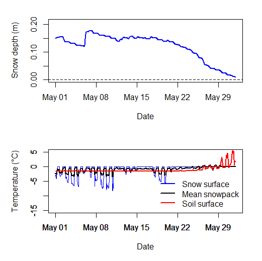

The simulation shows a persistent snowpack through early May, with depth initially increasing slightly due to intermittent snowfall before reaching a maximum of around 0.16–0.17 m. Thereafter, the snowpack gradually declines, with a more rapid melt phase occurring in the latter part of the month, leading to near-complete disappearance by the end of May. Temperature dynamics reflect strong coupling between the snowpack and atmosphere: the snow surface temperature (blue) remains highly variable and frequently drops well below 0 °C, closely tracking cold air incursions, while the mean snowpack temperature (black) is more buffered and remains closer to freezing. In contrast, the underlying ground surface temperature (red) is strongly damped and remains near 0 °C throughout, illustrating the insulating effect of the snowpack and its role in decoupling soil temperatures from short-term atmospheric variability.

### Canopy snow interception
In forested environments, a substantial fraction of snowfall can be intercepted by vegetation before it reaches the ground. This intercepted snow is temporarily stored on branches and needles, where it may subsequently sublimate, melt, or be unloaded to the ground. As canopy storage fills, interception efficiency declines, reflecting the limited capacity of the canopy to hold snow.

Canopy snow interception can be calculated following Hedstrom & Pomeroy (1998) using function `CanopySnowInterception`, in which interception is governed by canopy structure, wind conditions, and the current canopy snow load relative to a maximum storage capacity. This capacity is determined by the parameter `Sh`, which represents the snow load per unit branch area and controls the overall interception potential of the canopy per unit 'pai'.

In the example below, the `CanopySnowInterception` function is used to calculate fractional interception across a range of pai values under fixed environmental conditions.

```{r eval=FALSE}
# Vary canopy plant area index
pai_seq <- seq(0.1, 6, length.out = 100) # plant area index

# Compute canopy snow interception (mm SWE)
interception <- CanopySnowInterception(hgt = 8, # canopy height (m)
                                       pai = pai_seq,
                                       uf = 0.3, # friction velocity (m s^-1)
                                       prec = 5, # snowfall amount (mm SWE)
                                       tc = -5, # air temperature (°C)
                                       Li = 0) # initial intercepted snow (mm SWE)

# Convert to fraction of snowfall intercepted
frac_intercepted <- interception / 5

# ----------------------------- Plot results ------------------------------ #
par(mfrow = c(1, 1))
plot(pai_seq, frac_intercepted,
     type = "l",
     lwd = 2,
     ylim = c(0, 1),
     xlab = "Plant area index (PAI)",
     ylab = "Interception fraction")
```
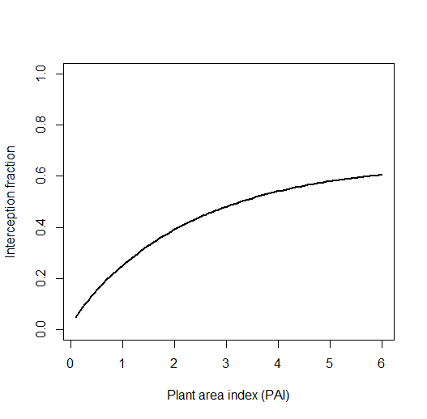

## Animal energy budgets
In this section we present some simple approaches for computing the body temperature of ectotherms and the energy budget of endotherms. The animal is represented geometrically as a triaxial ellipsoid defined by its length, width, and height, providing a flexible but tractable approximation that allows key physical properties such as volume, surface area, and directional exposure to be calculated.

These quantities underpin all components of the energy budget. Radiative exchange depends on how the body interacts with directional (direct) and hemispheric (diffuse and longwave) fluxes, convective heat loss depends on the characteristic dimension of the body relative to airflow, and metabolic heat production depends on body size and temperature.

The following sections describe how these components are calculated. We first consider radiation absorption, including the role of body orientation and projected (silhouette) area in determining interception of direct solar radiation. We then derive the resistance to heat loss via convection, followed by formulations for metabolic heat production. These components are finally combined to solve for body temperature in ectotherms and energy balance in endotherms.

### Radiation absorption
In our animal models, absorbed radiation is calculated from upward and downward shortwave and longwave fluxes, with absorption determined by surface reflectance and body geometry. Diffuse shortwave and longwave radiation are treated as hemispheric fluxes, such that absorption is proportional to the mean of the upward and downward components. In contrast, direct shortwave radiation is directional, and the amount absorbed depends on the area of the body projected normal to the solar beam.

We account for this by scaling direct shortwave radiation by the ratio of projected (silhouette) area to total surface area. This dimensionless coefficient captures how body orientation relative to the sun modifies energy gain. The projected area, and hence the interception coefficient, is calculated as a function of solar geometry and body orientation using the `silhouette` function. 

The example below illustrates how the interception of direct solar radiation varies over the course of a day for a simple human geometry. Solar zenith and azimuth angles are calculated for a midsummer day, and only daylight hours are retained. The body is represented using typical dimensions for an upright adult (height = 170 cm, width = 45 cm, length = 25 cm), where width corresponds approximately to shoulder breadth and length to front–back body depth. The individual is assumed to be upright (zero tilt) and facing south (`adir = 180`). The `silhouette` function is then used to compute the fraction of direct beam radiation intercepted (i.e. the projected area divided by total surface area) as solar position changes through the day. Note that this representation is geometrically symmetric: an equivalent configuration could be obtained by exchanging height and length and setting the body tilt to 90°, illustrating that it is the orientation of the principal axes relative to the solar beam, rather than their labels, that determines interception.

```{r eval=FALSE}
# Calculate solar zenith and azimuth as function of time of day
tme <- as.POSIXlt((0:1439) * 60,
                  origin = "2025-06-21 00:00",
                  tz = "UTC")
solp <- sunposition(tme,
                    lat = 50,
                    long = 0)
# Select daylight hours only
sel <- which(solp$zen < 90)
tme <- tme[sel]
solp <- sunposition(tme,
                    lat = 50,
                    long = 0)

# Calculate fraction of direct radiation intercepted by an upright
# human facing south
height <- 170 # height (cm)
width <- 45 # width (cm)
len <- 25 # body depth (cm)
svals <- silhouette(solp$zen,
                    solp$azi,
                    height,
                    width,
                    len,
                    adir = 180, # facing south (degrees)
                    atilt = 0.0, # upright posture
                    position = "fixed")

# ----------------------------- Plot results ------------------------------ #
par(mfrow = c(1, 1))
plot(svals$SolarCoef ~ as.POSIXct(tme),
     type = "l",
     col = "red",
     lwd = 2,
     ylim = c(0, 0.5),
     xlab = "Hour",
     ylab = "Fraction of direct beam radiation intercepted")
```
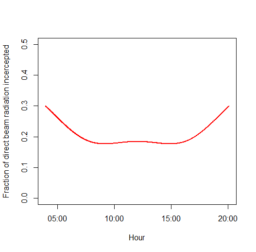

The `position` argument controls how body orientation is specified When `fixed`, the body maintains a constant orientation defined by `adir`  - the direction from north in which the animal is facing and `atilt` - which specifies the angle between the body’s height axis and the vertical.
The options `max` and `min` instead assume that the body adopts the orientation that maximises or minimises interception of direct radiation at each time step, representing extreme behavioural thermoregulation. The `randomdir` option assumes the body rotates freely in the horizontal plane (i.e. azimuth is random) while maintaining a fixed tilt, whereas `random` assumes both azimuth and tilt are random, giving an orientation-averaged interception. Together, these options provide a simple way to represent a range of behavioural and postural assumptions, from fixed orientation through to fully random or optimised alignment with the solar beam.


### Resistance to heat loss
As for leaves, resistance to sensible heat loss depends on body size, with larger animals developing thicker boundary layers and therefore exchanging heat less efficiently. For animals, however, the relevant dimension for convection also depends on orientation, because the characteristic dimension is typically taken as body volume divided by the area projected normal to the airflow. The same animal can therefore have different boundary layer resistances depending on how it is aligned relative to the wind.

We calculate projected area using the `silhouette` function. Although designed for radiation, the same geometry can be used here by treating the wind as a horizontal beam, so that the projected area normal to flow is obtained from the body shape and orientation. This projected area is then used to derive the characteristic dimension supplied to `animalrHa`, which computes boundary layer resistance from standard forced- and free-convection relationships.

The example below shows how boundary layer resistance varies with orientation relative to the wind for a simple animal geometry. We first set the animal dimensions, assign a range of directions and then compute the characteristic dimension as a function of the orientation in which it is facing. Finally, we plot both the characteristic dimension and resistance as a function of orientation.  

```{r eval=FALSE}
# Animal geometry (cm)
height <- 12 # height (cm)
width <- 8 # width (cm)
len <- 25 # length (cm)

# Orientation relative to wind direction
adir <- seq(0, 180, by = 1) # orientation angle (degrees)

# Characteristic dimension (m)
d <- chardim(wdir = 0, # wind direction (degrees)
             height,
             width,
             len,
             adir,
             atilt = 0, # body tilt angle (degrees)
             position = "fixed")

# Boundary layer resistance at fixed conditions
rHa <- sapply(d, function(dd) {
  animalrHa(tair = 20, # air temperature (°C)
            dT = 5, # body-air temperature difference (°C)
            uz = 1, # wind speed (m s^-1)
            d = dd) # characteristic dimension (m)
})

# ----------------------------- Plot results ------------------------------ #
par(mfrow = c(2, 1),
    mar = c(5, 5, 2, 2))
plot((d * 100) ~ adir,
     type = "l",
     lwd = 2,
     ylim = c(0, 25),
     xlab = "Orientation relative to wind direction (degrees)",
     ylab = "Characteristic dimension (cm)")
plot(rHa ~ adir,
     type = "l",
     lwd = 2,
     ylim = c(0, 100),
     xlab = "Orientation relative to wind direction (degrees)",
     ylab = expression("Boundary layer resistance (s m"^-1 * ")"))
```
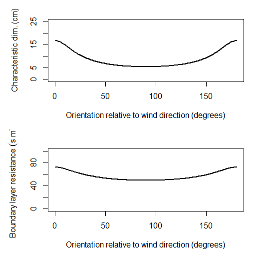

The characteristic dimension and hence also the resistance to heat loss is lowest when the animal is side-on to the direction of the wind. Here the wind is blowing past the front and back of the animal, so the distance over which laminar flow develops is shorter and the boundary layer remains thinner. Conversely, when the animal is aligned with the wind, this distance is greater, allowing a thicker boundary layer to develop and increasing resistance to heat loss.

### Metabolic rates
Metabolic heat production forms one component of the animal energy balance. In ectotherms it is often small relative to radiative and convective fluxes, but can still influence body temperature, particularly in larger or more active animals. In endotherms, by contrast, metabolism is typically the dominant heat source and must offset environmental heat loss.

In the tutorial, the metabolic rate is calculated using the `metabolic_rate` function and  depends on body mass and body temperature. Mass is obtained from volume and density, and metabolic heat production is expressed per unit surface area so that it is directly comparable with the other energy balance terms.

For ectotherms, metabolic rate is controlled by four parameters: a normalisation constant (`a0`), a mass-scaling exponent (`b`), a temperature sensitivity (`Q10`), and a reference temperature (`Tref`). The exponent `b` determines how metabolism scales with body size and typically lies close to 0.7–0.8. The parameter `Q10` controls how rapidly metabolism increases with temperature, with values around 2–3 common for ectotherms, implying an approximate doubling or tripling of metabolic rate per 10 °C. The normalisation constant `a0` sets the overall magnitude of metabolic rate at the reference temperature, and therefore captures differences among taxa and activity levels. Together, these parameters define how strongly metabolic heat production responds to both size and temperature.

The `create_ectop` function in the `micropoint` package assembles these parameters for different ectotherm types alongside body geometry and surface properties. Body dimensions are used to estimate volume and surface area assuming an ellipsoid, while defaults are assigned for traits such as density, emissivity, thermal conductivity, evaporative skin fraction and conductive contact with the substrate. These defaults vary by organism type (e.g. arthropod, reptile, amphibian), but can be modified as needed.

For endotherms, the same parameters can be used, but their interpretation differs. The exponent b is typically similar (≈0.7–0.75), while Q10 is often lower (≈1.5–2) because metabolic rate is more tightly regulated with respect to temperature. The normalisation constant a0 is much larger, reflecting substantially higher metabolic rates per unit mass. As a result, metabolism is not a minor term but the primary heat source in the energy balance, and changes in a0 directly affect the capacity to maintain body temperature under different environmental conditions.

In the example below, we show how the metabolic rate of a typically-sized reptile varies as a function of its body temperature

```{r eval=FALSE}
# Animal geometry (cm)
height <- 12 # height (cm)
width <- 8 # width (cm)
len <- 25 # length (cm)

# Create ectotherm parameter set
ecto_params <- micropoint::create_ectop(height,
                                        width,
                                        len,
                                        refl = 0.1, # body reflectance
                                        adir = 0, # orientation angle (degrees)
                                        position = "randomdir", # random orientation
                                        type = "reptile") # ectotherm type

# Assign variable body temperature
Tbody <- seq(-5, 60, length.out = 100) # body temperature (°C)

# Compute metabolic rate
met_rate <- with(ecto_params,
                 metabolic_rate(volume, # body volume (m^3)
                                rho, # body density (kg m^-3)
                                Q10, # temperature sensitivity coefficient
                                a0, # allometric intercept
                                b, # allometric exponent
                                Tref, # reference temperature (°C)
                                Tbody))

# ----------------------------- Plot results ------------------------------ #
par(mfrow = c(1, 1))
plot(met_rate ~ Tbody,
     type = "l",
     col = "red",
     lwd = 2,
     xlab = expression("Body temperature (" * degree * "C)"),
     ylab = expression("Metabolic rate (W)"))
```
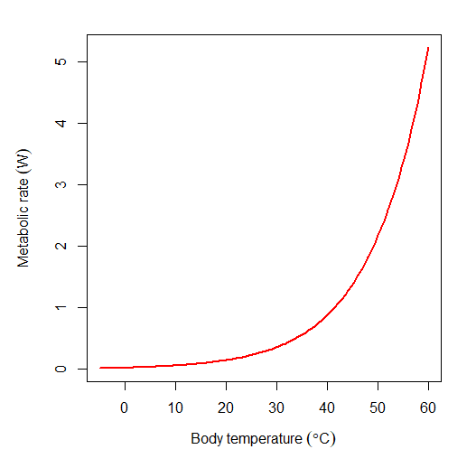

### Ectotherms
The components described above are combined in the `Ectothermtemp` function, which solves for ectotherm body temperature at a single time step from animal traits, time and location, and a set of local microclimate variables. The required animal properties are supplied via the ecto_params object returned by create_ectop, while microcdata provides the near-body environmental conditions, including air and surface temperature, humidity, wind speed and direction, and the upward and downward shortwave and longwave fluxes.

The function first calculates solar position from time, latitude and longitude, and uses this together with body geometry and orientation to determine the fraction of direct solar radiation intercepted. Absorbed shortwave and longwave radiation are then calculated from the relevant flux components, accounting for surface reflectance, emissivity, and the fraction of the body in conductive contact with the substrate. The same body geometry is then used to compute the characteristic dimension relevant to convective heat exchange, by treating the wind as a horizontal beam and calculating projected area normal to the flow.

Body temperature is obtained iteratively because several terms depend on body temperature itself. At each iteration the function updates the boundary layer resistance to heat loss, metabolic heat production, radiative emission, sensible heat exchange, conductive exchange with the substrate, and latent heat exchange from exposed and contacting surfaces. These terms are then combined to give an updated estimate of body temperature, and iteration continues until the change between successive estimates falls below the specified tolerance.

This is a single-time-step calculation, so to predict body temperature through time it must be called repeatedly using time-varying microclimate inputs. In practice, this means first running the microclimate model to obtain the local conditions experienced by the animal, and then passing these to Ectothermtemp at each time step.

The example below illustrates this workflow for a small reptile in short grass. We first subset the weather data to June, define the vegetation and soil properties, and initialise the soil heat model. We then create the ectotherm parameter list, specifying body dimensions, reflectance and orientation assumptions. At each hourly time step the canopy and soil models are run to estimate the local microclimate, including near-surface air temperature and humidity, surface temperature, and the relevant radiative fluxes. These are assembled into a `microcdata` list and passed to `Ectothermtemp`, which returns body temperature for that hour.

```{r eval=FALSE}
# -------------------- Create June weather dataset ------------------------- #
weather <- micropoint::climdata

# Select data for June
tme <- as.POSIXlt(weather$obs_time, tz = "UTC")
sel <- which(tme$mon + 1 == 6)
weather <- weather[sel,]
tme <- tme[sel]

# -------------------- Create vegetation parameter set -------------------- #
# Sparse short grass canopy
vegp <- createplant_inputs("C3")
vegp$h <- 0.05     # canopy height (m)
vegp$pai <- 0.1    # plant area index

# Zero-plane displacement height
d <- zeroplanedis(0.05, 0.1)

# -------------------- Create soil datasets and initialise models --------- #
groundp <- micropoint::groundparams

# Lower soil boundary temperature
boundaryT <- 11.36071

soilp <- createsoilplist(
  soiltype = "Clay loam",
  nlayers = 15,
  totalDepth = 2,
  slope = 0,
  aspect = 180,
  surface_organicmu = 1,
  FreeDrain = TRUE
)

# Number of soil layers
n <- length(soilp$b)

# Initial soil temperature profile
Te <- seq(weather$temp[1], boundaryT, length.out = n)

# Initial soil water content profile
theta <- seq(0.2, soilp$Smax[n], length.out = n)

# Initialise soil heat model
soilheat <- InitSoilheatmod(soilp, Te, theta)

# -------------------- Create ectotherm parameter set --------------------- #
ecto_params <- micropoint::create_ectop(
  height = 12,
  width = 8,
  len = 25,
  refl = 0.1,
  adir = 0,
  position = "randomdir",
  type = "reptile"
)

# -------------------- Run model in hourly timesteps ---------------------- #
Tbody <- G <- Tsurface <- 0

for (hr in 1:720) {

  # Initialise convergence criterion
  error <- 1e99
  itr <- 1

  # Iteratively solve canopy and soil energy balance
  while (error > 1e-2 && itr < 20) {

    # -------------------- Run microclimate model ------------------------ #

    # Estimate relative humidity at soil surface
    soilrh <- soilrelhum(
      0.2,
      soilheat$Te[1],
      psie = -3.26,
      b = 6.62,
      Smax = 0.46
    )

    # Solve canopy energy balance
    can <- solve_wholecanopy(
      weather,
      vegp,
      groundp,
      hr,
      49.96807,
      -5.215668,
      zref = 2,
      G,
      0.2,
      soilrh / 100
    )

    # -------- Resistance between soil surface and atmosphere ------------ #

    rHg <- groundresistance(
      vegp$h,
      vegp$pai,
      can$uf,
      can$LL,
      can$psih,
      zref = 2
    )

    # -------------------- Solve soil heat transport --------------------- #

    soilheat <- SoilHeatModel(
      soilheat,
      soilp,
      Rabs = can$Rabs,
      Tref = weather$temp[hr],
      relhum = weather$relhum[hr],
      atmPressure = weather$pres[hr],
      rHg
    )

    # Update convergence criterion
    error <- abs(G - soilheat$Gflux)
    G <- soilheat$Gflux
    itr <- itr + 1
  }

  # --------- Calculate conditions 6 cm above the ground surface --------- #

  # Roughness length
  zm <- roughlength(vegp$h, vegp$pai, d, can$psih)

  # Stability correction term
  psih6 <- dpsih(zm / can$LL) -
    dpsim((0.06 - d) / can$LL)

  # Aerodynamic resistance at 6 cm
  rHaz <- (log((0.06 - d) / (0.2 * zm)) + psih6) /
    (0.41 * can$uf)

  # Air temperature at 6 cm
  Tz <- weather$temp[hr] +
    (can$tcanopy - weather$temp[hr]) *
    ((can$rHa - rHaz) / can$rHa)

  # Vapour pressures
  es <- satvap(can$tcanopy)
  ea <- satvap(weather$temp[hr]) *
    (weather$relhum[hr] / 100)

  # Vapour pressure at 6 cm
  ez <- ea +
    (es - ea) *
    (can$rHa + rHaz) / (can$rHa + can$rS)

  # Relative humidity at 6 cm
  Rhz <- pmin((ez / satvap(Tz)) * 100, 100)

  # Wind speed at 6 cm
  uz <- (can$uf / 0.41) *
    (log((0.06 - d) / zm) + can$psim)

  # --------- Calculate upward and downward radiation fluxes ------------ #

  # Solar geometry
  solp <- sunposition(
    tme[hr],
    lat = 49.96807,
    long = -5.215668
  )

  # Surface albedo
  albs <- albedo(
    vegp$pai,
    vegp$lref,
    vegp$ltra,
    vegp$x,
    groundp$gref,
    groundp$slope,
    groundp$aspect,
    solp
  )

  # Compute direct and reflected shortwave radiation
  if (weather$swdown[hr] > 0) {

    Rdirdown <- (weather$swdown[hr] -
      weather$difrad[hr]) /
      cos(solp$zen * pi / 180)

    Rswup <- albs$albd * weather$difrad[hr] +
      Rdirdown * cos(solp$zen * pi / 180) *
      albs$albb

  } else {

    Rdirdown <- Rswup <- 0
  }

  # ---------------- Calculate ectotherm body temperature --------------- #

  microcdata <- list(
    Tair = Tz,
    Tsurf = can$tcanopy,
    relhum = Rhz,
    surfrelhum = 100,
    pk = weather$pres[hr],
    windspeed = uz,
    winddir = weather$winddir[hr],
    Rdirdown = Rdirdown,
    Rdifdown = weather$difrad[hr],
    Rswup = Rswup,
    Rlwdown = weather$lwdown[hr],
    Rlwup = vegp$em *
      5.67e-8 *
      (can$tcanopy + 273.15)^4
  )

  # Solve ectotherm heat balance
  Tbody[hr] <- Ectothermtemp(
    ecto_params,
    tme[hr],
    microcdata,
    lat = 49.96807,
    long = -5.215668
  )
}

# ------------------------- Plot temperatures ----------------------------- #
tmec <- as.POSIXct(tme)

# Air temperature
plot(
  weather$temp ~ tmec,
  type = "l",
  xlab = "Date",
  ylab = "Temperature (°C)",
  ylim = c(0, 45),
  col = rgb(0, 0, 0, 0.5),
  lwd = 2
)

# Ectotherm body temperature
par(new = TRUE)

plot(
  Tbody ~ tmec,
  type = "l",
  xlab = "",
  ylab = "",
  ylim = c(0, 45),
  col = "red"
)

# Add legend
legend(
  "topleft",
  legend = c("Air temperature", "Body temperature"),
  col = c(rgb(0, 0, 0, 0.5), "red"),
  lwd = 2,
  bty = "n"
)
```
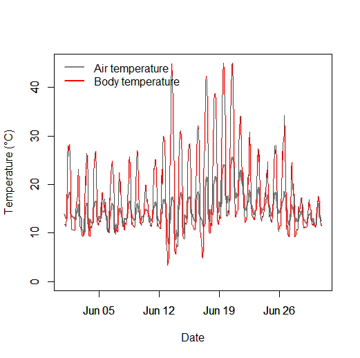

Body temperature is predicted from the local conditions experienced by the animal near the ground, not directly from standard weather data. The microclimate model is therefore used first to translate reference-height meteorological observations into temperature, humidity and radiative conditions at the animal’s height, and these are then passed to Ectothermtemp.

In the final plot, the red line shows predicted body temperature and the black line the corresponding air temperature from the weather data. Differences between the two arise because the animal exchanges heat not only with the air, but also with radiation, the ground surface and the substrate.

The microcdata object contains the quantities needed for this calculation: air temperature and humidity at the animal’s height (Tair, relhum), surface temperature and upward longwave flux from below (Tsurf, Rlwup), and the direct, diffuse and reflected shortwave components (Rdirdown, Rdifdown, Rswup).

### Endotherms
For endotherms, the treatment here is restricted to birds and mammals and is intentionally simple. A more complete representation of endotherm energy balance would need to account explicitly for processes such as active control of blood flow to the skin, variation in insulation with fur or feather depth and posture, evaporative cooling, and metabolic adjustments associated with thermogenesis or heat dissipation. Readers are referred to the'NicheMapR` package for more complex handling. Here, these complexities are represented in a highly simplified way through alternative resistances to sensible heat loss under warm and cold conditions.

As for ectotherms, boundary layer resistance is first calculated from body size, shape and orientation relative to the wind. For endotherms, however, this is only one component of the total resistance to heat loss. In mammals, the boundary layer sits outside an insulating coat, and heat must also pass through the coat itself and through tissues whose conductance can vary with vasodilation or vasoconstriction. The `mammal_resistance` function therefore combines boundary layer, coat and vascular resistances to give total resistances under warm and cold conditions. Coat resistance depends on coat thickness and decreases with wind speed, while vascular resistance is represented using fixed values corresponding to greater or lesser blood flow to the body surface.

For birds, the same general logic applies, but insulation is represented through plumage conductance rather than coat thickness. The bird_resistance function combines boundary layer resistance with a plumage resistance estimated from body mass using an allometric scaling relationship, such that larger birds have lower mass-specific conductance and therefore greater insulation. Alternative values represent reduced and increased insulation, capturing warm and cold states in a simple way, rather than resolving the detailed structure of feathers or ptiloerection.

These resistance terms are then used in the `Endothermstress` function, which calculates net energy balance at a single time step from animal traits, time and location, and local microclimate. As for ectotherms, solar position is first used together with body geometry and orientation to determine interception of direct solar radiation, from which absorbed shortwave and longwave radiation are calculated. Longwave emission is then calculated from body temperature, and sensible heat exchange is computed separately using the warm and cold resistance states. These correspond to lower and higher total resistances to heat loss (e.g. vasodilation vs vasoconstriction or reduced vs increased insulation), giving alternative estimates of heat exchange with the air and substrate. Basal metabolic heat production is added as an internal heat source, and energy balance is evaluated under both resistance states. The function then selects the appropriate state depending on whether the animal would otherwise gain or lose heat, and returns the resulting net energy balance for the whole animal.

The interpretation of the function output differs from the ectotherm case. Rather than solving directly for body temperature, the function evaluates whether the animal is in positive or negative energy balance at its assumed body temperature. Positive values indicate a net heat gain and negative values a net heat loss. In this way, the model provides a simple index of thermal stress under different environmental conditions, while allowing for limited physiological buffering through changes in insulation and vascular resistance.

To illustrate the use of `Endothermstress`, we consider a lion under a simple set of near-ground microclimatic conditions. Because the built-in weather dataset is from southwest England, we first modify it to be more representative of a warmer, sunnier African environment. This also provides an opportunity to demonstrate two additional utility functions included in the package: `clearskyrad`, which estimates clear-sky shortwave radiation, and `difprop`, which estimates the diffuse fraction of incoming shortwave radiation from total flux and solar geometry.

In the example below, we first subset the weather data to June. Air temperature is then increased by 12 °C, while relative humidity is adjusted assuming constant vapour pressure. Downward longwave radiation is modified by deriving an effective sky emissivity from the original data and reducing it slightly to represent clearer skies. Wind speed is also reduced. Shortwave radiation is adjusted in two steps. First, clearskyrad is used to estimate the clear-sky incoming shortwave flux, allowing the observed data to be expressed as a clear-sky fraction. This fraction is then shifted upward using a logit transform to represent sunnier conditions, and combined with a new clear-sky radiation estimate for the modified climate and location. Finally, `difprop` is used to estimate the diffuse fraction from total shortwave radiation and solar geometry. The resulting dataset can then be used to drive the endotherm model.


```{r eval=FALSE}
# -------------------------- Select June weather ---------------------------- #
weather <- micropoint::climdata
# Extract time and subset to June
tme <- as.POSIXlt(weather$obs_time, tz = "UTC")
sel <- which(tme$mon + 1 == 6)
weather <- weather[sel, ]
tme <- tme[sel]

# -------------------------- Helper functions ------------------------------- #
# Logit transforms used to adjust bounded variables (0–1)
logit <- function(x) log(x / (1 - x))
inv_logit <- function(x) 1 / (1 + exp(-x))

# -------------------------- Adjust temperature & humidity ------------------ #
# Increase temperature to represent warmer (e.g. tropical) conditions
temp_new <- weather$temp + 12
# Recalculate relative humidity assuming constant vapour pressure
ea <- satvap(weather$temp) * (weather$relhum / 100)
relhum_new <- (ea / satvap(temp_new)) * 100

# -------------------------- Adjust longwave radiation ---------------------- #
# Derive sky emissivity from observed longwave radiation
skyem <- weather$lwdown / (5.67e-8 * (weather$temp + 273.15)^4)
# Reduce emissivity slightly (clearer skies → lower emissivity)
skyem_new <- inv_logit(logit(skyem) - 0.3)

# Recalculate downward longwave radiation using updated emissivity and temperature
lwdown_new <- skyem_new * 5.67e-8 * (temp_new + 273.15)^4

# Assemble updated weather object
weather_new <- weather
weather_new$temp <- temp_new
weather_new$relhum <- relhum_new
weather_new$lwdown <- lwdown_new
weather_new$windspeed <- 0.5 * weather$windspeed

# -------------------------- Adjust shortwave radiation --------------------- #
# Compute clear-sky radiation for original conditions
csr <- clearskyrad(weather, 49.96807, -5.215668)

# Calculate clear-sky fraction
csf <- weather$swdown / csr

# Increase clearness (make conditions sunnier) using logit transform
csf_new <- inv_logit(logit(csf) + 0.3)

# Recompute clear-sky radiation for new (warmer) conditions and location
csr_new <- clearskyrad(weather_new, -1.21867, -5.215668)

# Apply adjusted clear-sky fraction
weather_new$swdown <- csf_new * csr_new

# Ensure nighttime and invalid values are handled
weather_new$swdown[weather$swdown == 0] <- 0
weather_new$swdown[is.na(weather_new$swdown)] <- 0

# -------------------------- Partition into diffuse radiation --------------- #
# Compute diffuse fraction based on solar geometry and atmospheric conditions
diffrac <- difprop(weather_new, -1.21867, -5.215668)

# Calculate diffuse shortwave radiation
weather_new$difrad <- diffrac * weather_new$swdown
```

The endotherm example is quite similar to the ectotherm example. We first create the necessary vegetation and soil parameters. However, rather than using an inbuilt function to create the list of endotherm parameters we do this manually. 

```{r eval=FALSE}
# -------------------- Create Vegetation datasets ---------------------------- #
# Short grass
vegp <- createplant_inputs("C3")
vegp$h <- 0.05
vegp$pai <- 0.1
d <- zeroplanedis(0.05, 0.1)
# -------------------- Create Soil datasets and initialize models ------------ #
groundp <- micropoint::groundparams
boundaryT <- 23.3 # soil lower boundary layer temperature
soilp <- createsoilplist(soiltype = "Clay loam", nlayers = 15, totalDepth = 2, 
                         slope = 0, aspect = 180,
                         surface_organicmu = 1, FreeDrain = TRUE)
n <- length(soilp$b)
Te <- seq(weather_new$temp[1], boundaryT, length.out = n)
theta <- seq(0.2, soilp$Smax[n], length.out = n)
soilheat <- InitSoilheatmod(soilp, Te, theta)
# ----------------------- Create endootherm model paramaters ----------------- #
endo_params <- list(height = 110, width = 50, len = 200, adir = 0, atilt = 5, 
                    position = "fixed", Tbody = 38.5, confrac = 0.3,
                    coatthick = 1, basmet = 180, type = "mammal", 
                    refl = 0.27, em = 0.97)
```

We are now ready to run the model at hourly timesteps. Air temperature is calculated at 55 cm above the ground—approximately half the height of the lion—rather than at 6 cm as in the ectotherm example. Vapour pressure at this height is also retained as we check later whether latent heat loss could, in principle, offset the energy balance.

```{r eval=FALSE}
# ----------------------- Run model in hourly timesteps ---------------------- # 
Estress <- G <- maxL <- Tsurface <- 0  # Initialize variables
for (hr in 1:720) {
  error <- 1e99
  itr <- 1
  while (error > 0.1 && itr < 20) {
    # ------------------------- Run microclimate model sun ------------------  #
    soilrh <- soilrelhum(0.2, soilheat$Te[1], psie = -3.26, b = 6.62, 
                         Smax = 0.46)
    can <- solve_wholecanopy(weather_new, vegp, groundp, hr, 
                             -1.21867, -5.215668, zref = 2, 
                             G, 0.2, soilrh / 100)       
    # ----------- Compute resistance from ground surface to zref ------------  #
    rHg <- groundresistance(vegp$h, vegp$pai, can$uf, can$LL, can$psih, 
                            zref = 2)
    # ------------------------------Run soil heat model ---------------------  #
    soilheat <- SoilHeatModel(soilheat, soilp, Rabs = can$Rabs, 
                              Tref = weather_new$temp[hr], 
                              relhum = weather_new$relhum[hr], 
                              atmPressure = weather_new$pres[hr], rHg)
    error <- abs(G - soilheat$Gflux)
    error
    G <- soilheat$Gflux
    itr <- itr + 1     
  } 
  # ----- Calculate air temperature and relative humidity 6 cm above ground -- #
  zm <- roughlength(vegp$h, vegp$pai, d, can$psih)
  psih55 <- dpsih(zm / can$LL) - dpsim((0.55 - d) / can$LL)
  rHaz <- (log((0.55 - d) / (0.2 * zm)) + psih55) / (0.41 * can$uf)
  Tz <- weather_new$temp[hr] + (can$tcanopy - weather_new$temp[hr]) * 
    ((can$rHa - rHaz) / can$rHa) 
  es <- satvap(can$tcanopy)
  ea <- satvap(weather_new$temp[hr]) * (weather_new$relhum[hr] / 100)
  ez <- ea + (es - ea) * (can$rHa + rHaz) / (can$rHa + can$rS)
  # ------- Calculate downward and upward radiative fluxes ------------------- #
  solp <- sunposition(tme[hr], lat = -1.21867, long = -5.215668)
  albs <- albedo(vegp$pai, vegp$lref, vegp$ltra, vegp$x, groundp$gref, 
                 groundp$slope, groundp$aspect, solp)
  if (weather_new$swdown[hr] > 0) {
    Rdirdown <- (weather_new$swdown[hr] - weather_new$difrad[hr]) / 
      cos(solp$zen * pi / 180)
    Rswup <- albs$albd * weather_new$difrad[hr] + 
       Rdirdown * cos(solp$zen * pi / 180) * albs$albb
  } else {
    Rdirdown <- Rswup <- 0
  }
  uz <- (can$uf / 0.41) * (log((0.55 - d) / zm) + can$psim) 
  # ---------------- Calculate maximum latent heat loss ---------------------- # 
  surfaceArea <- 4.281374
  effwetarea <- 0.03 * surfaceArea
  la <- latvap(38.5)
  esa <- satvap(38.5)
  rho <- rhohair(Tz, weather_new$pres[hr])
  rHa <- animalrHa(Tz, abs(Tz - 38.5), uz, d)
  maxL[hr] <- ((la * rho) / (rHa * weather_new$pres[hr]))* 
    (esa - ez) *  effwetarea 
  # ---------------- Calculate ectotherm body temperature -------------------- #
  microcdata <- list(Tair = Tz, 
                     Tsurf = can$tcanopy, 
                     pk = weather$pres[hr], 
                     windspeed = uz, 
                     winddir = weather$winddir[hr],
                     Rdirdown = Rdirdown, 
                     Rdifdown = weather$difrad[hr], 
                     Rswup = Rswup, 
                     Rlwdown = weather$lwdown[hr], 
                     Rlwup = vegp$em * 5.67e-8 * (can$tcanopy + 273.15)^4)
   Estress[hr] <-  Endothermstress(endo_params, tme[hr], microcdata, 
                               lat = -1.21867, -5.215668)
}
```

The resulting energy balance is then compared with simple upper and lower bounds. The lower bound is given by the additional metabolic heat that can be generated above basal, while the upper bound is a crude estimate of the maximum latent heat loss under the same conditions, assuming a fixed fraction of the surface behaves as a freely evaporating surface.

```{r eval=FALSE}
# ------------------plot time series of endotherm stress --------------------- #
tmec <- as.POSIXct(tme, tz = "UTC")
plot(Estress ~ tmec, type = "l", ylim = c(-1000, 1300),
     xlab = "Date", ylab = "Stress index")
# -------------------------------plot upper limit ---------------------------- #
par(new = TRUE)
plot(maxL ~ tmec, type = "l", col = "red", ylim = c(-1000, 1300), 
     xlab = "", ylab = "")
# -------------------------------plot lower limit ---------------------------- #
abline(h = -480, col = "blue") 
```
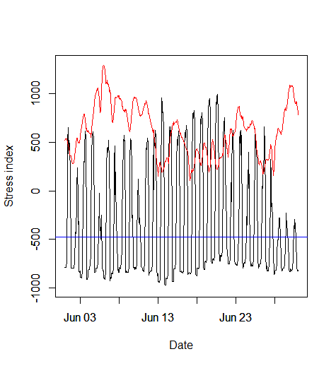

The modelled energy balance (black line) exceeds the estimated evaporative limit (red line), particularly under humid conditions, indicating that the lion would be unable to maintain balance through physiological means alone and would need to reduce heat gain, for example by seeking shade. At other times, energy balance falls well below the additional metabolic heat available above basal (blue line), indicating potential stress, indicating that the lion would need to mitigate heat loss by selecting more sheltered microclimates.

## Microclimate models

### micropoint
The `micropoint` package most closely replicates the modelling approaches outlined in this vignette. It is designed to derive microclimatic conditions or ectotherm body temperatures at single point locations and the majority of the functions are R wrappers for C++ code that replicates the R functions detailed in this vignette. It can thus be thought of as a fast version of the `microlearn` package designed for practical use. It supersedes the `microclimc` package (Maclean & Klinges 2021), updating the treatment of below-canopy microclimate processes and improving computational efficiency through the use of underlying C++ implementations.

The package is still in development, but is available for use with the disclaimer that, as the codebase is still evolving, stability and backward compatibility cannot yet be fully guaranteed.Currently two parallel versions of the package exist:

(1) a new version that uses the full multi-layer soil heat and water models described in this vignette. A tutorial for this version of the package is available from [here](https://rpubs.com/ilyamaclean/micropointnew).

(2) an older version of the package that implements the simpler approach to deriving ground heat flux described above, in which ground heat flux is assumed to follow a sinusoidal cycle that scales with the amplitude of the diurnal cycle in soil surface temperature. This version of the package also uses a simpler method for estimating stomatal conductance, relying on fewer vegetation parameters and assuming limitation primarily by photosynthetically active radiation rather than soil moisture. A tutorial for this version of the package is available form [here](https://rpubs.com/ilyamaclean/1262923)

Both versions of the package are bundled together and installed as detailed below. They simply use different functions to evoke the different versions

```{r eval=FALSE}
require(devtools) # Install from CRAN if not already installed
devtools::install_github("ilyamaclean/micropoint")
library(micropoint)
```

An example output generated by the new version of the package is shown below. Here microclimatic temperatures conditions are derived 5 cm above ground for a 10 cm grassland using the `micropoint::RunMicro` function over the course of a year (red) using the inbuilt climate dataset. Macroclimatic temperatures 2m above ground are shown in grey.

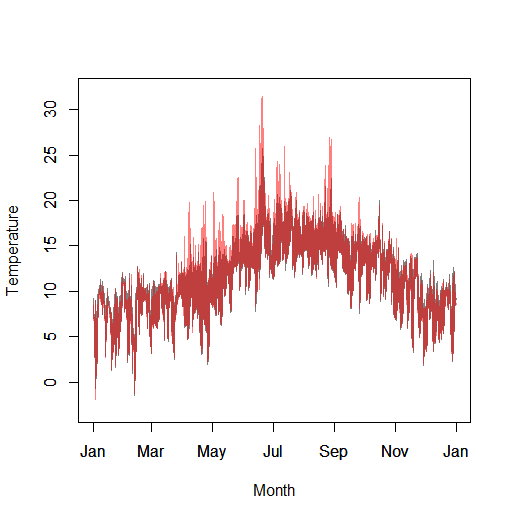

### microclimf
The `microclimf` package (Maclean 2026) extends `micropoint` to gridded applications and supersedes the microclimate components of the older package `microclima` (Maclean *et al* 2019) by modelling microclimate entirely form first principles. It allows microclimate models to be run efficiently across landscapes. A key challenge is that conventional microclimate models require iterative solutions at each location, which becomes computationally expensive when applied to many grid cells. The `microclimf` model addresses this by exploiting a near-linear relationship between errors in non-iterative surface temperature estimates and the corresponding air–surface temperature difference. In practice, the model is run iteratively at a single reference location, and the resulting relationships are then used to estimate temperatures across the rest of the grid without iteration. Additional efficiencies are achieved in the treatment of vegetation. Rather than resolving detailed vertical canopy structure, microclimf assumes that total sensible and latent heat fluxes can be represented at the canopy scale, and that vertical transfer profiles follow a generalised analytical form. This avoids the need for explicit multilayer canopy representation while retaining the key effects of vegetation on below-canopy microclimate.

Detailed instructions for using the package are provided [here](https://rpubs.com/ilyamaclean/runningmicroclimf). It is installed as follows:

```{r eval=FALSE}
require(devtools) # Install from CRAN if not already installed
devtools::install_github("ilyamaclean/microclimf")
library(microclimf)
```

An example output generated using `microclimf::runmicro_big` function the is shown below. Heretemperatures 5 cm above ground at 2 pm on 1 June 2017, modelled at 1m resolution for a 1×1km area around Caerthillian Cove, Cornwall, UK (49.968°N, 5.215°W). 

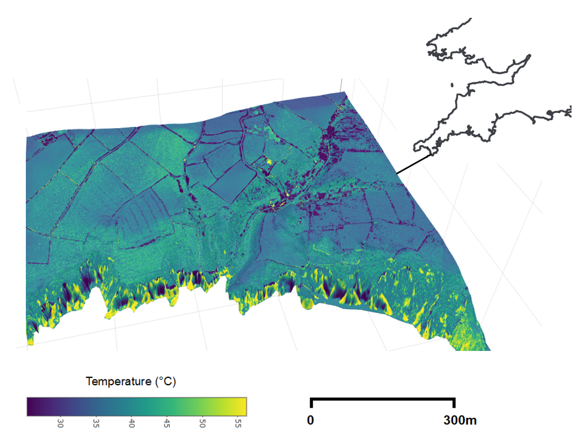

### mesoclim
So far, we have focused on the principles of microclimate modelling, deliberately excluding the downscaling of macroclimate data to finer spatial resolution. In other words, the emphasis has been on energy balance processes rather than adiabatic drivers of meso-scale climate variation, such as those associated with elevation or proximity to the coast. 

The `mesoclim` package is designed for climate downscaling. It provides functions to account for processes such as cold-air drainage, as well as elevation and water-body effects on climatic conditions measured at weather stations. It also includes tools for temporal downscaling of climate datasets and for bias correction of future climate projections. It also contains a range of functions for basic processing of climate datasets such as infilling of coastal grid cells. In effect, it provides the necessary climate forcing data required to run microclimate models. 

Detailed instructions for using the package are provided [here](to be added). It is installed as follows:

```{r eval=FALSE}
require(devtools) # Install from CRAN if not already installed
devtools::install_github("ilyamaclean/mesoclim")
library(mesoclim)
```

Below is an example figure generated with the aid of the the `mesoclim` package. It shows side-by-side comparisons of mesoclim output downscaled to 100 m resolution and the original 1 km HadCRU data from the UK Met Office. The maps depict the fraction of years in which the Isles of Scilly (a small island archipelago off southwest UK; 49.9°N, 6.3°W) experience a subtropical climate (defined as at least eight months with a mean temperature of 10^\circ C or above). In addition to resolving fine-scale spatial structure, the mesoclim output fills gaps where coarse-resolution data are absent, particularly around coastlines and small islands, producing spatially continuous and more realistic climatic surfaces.

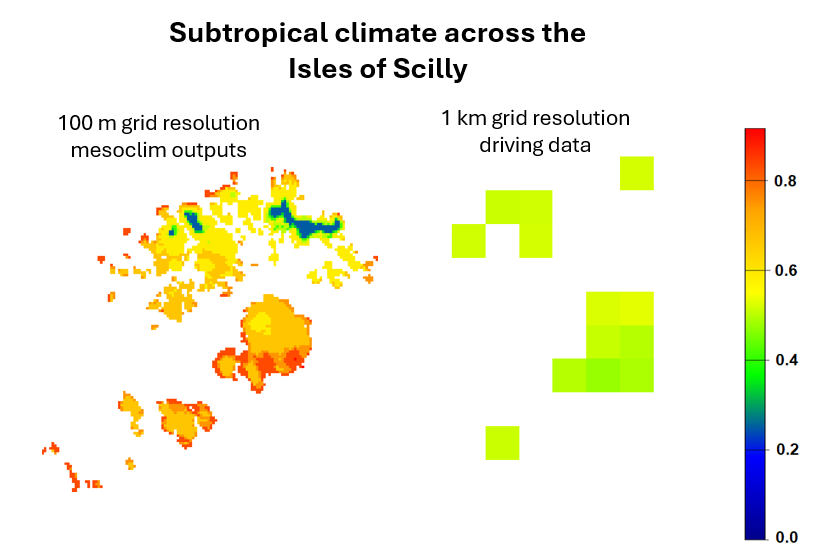

### microclimdata and mcera5
One of the main practical challenges in microclimate modelling is obtaining and preparing the required climate forcing, as well as vegetation and terrain predictor variables. The `mcera5` package (Klinges et al. 2022) provides convenient access to, and processing of, ERA5 climate data (from the ECMWF Copernicus Climate Data Store) for use in microclimate models. It can be installed as follows, and the package includes its own vignette explaining how to download and prepare the data.

```{r eval=FALSE}
remotes::install_github(“dklinges9/mcera5”
library(mcera5)
```

The `microclimdata` package extends the capabilities of `mcera5`, enabling the download and processing of a wider range of climate datasets. It also provides tools for obtaining, processing, and generating the vegetation and soil data required for microclimate modelling, and for deriving the necessary model parameters. Together, these allow microclimate models to be run globally at spatial resolutions down to ~10 m.

Detailed instructions for using the package are provided [here](https://rpubs.com/ilyamaclean/microclimdataguide). It is installed as follows:

```{r eval=FALSE}
require(devtools) # Install from CRAN if not already installed
devtools::install_github("ilyamaclean/microclimdata")
library(microclimdata)
```

Below is an example illustrating the capabilities of `microclimdata`. The left panel shows a 10 m resolution mosaic of Leaf Area Index (LAI) over a 1 km² area in Cornwall, UK (50.1°N, 5.3°W), generated using the `lai_download` and `lai_mosaic` functions, prior to cloud filling. The right panel shows the same dataset after applying `lai_fill` to infill areas obscured by cloud.

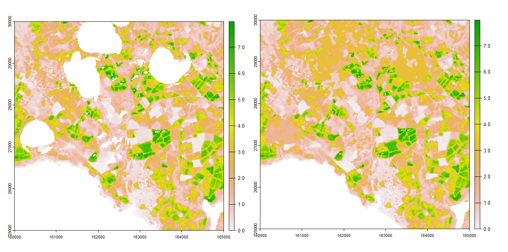

### NicheMapR
The NicheMapR package (Kearney & Porter 2017) is a comprehensive biophysical modelling framework that links microclimate conditions to organismal heat, water and energy balance. It is built around a set of well-established Fortran models, wrapped in R, and is widely used for mechanistic niche modelling—that is, predicting where species can persist based on first-principles representations of how environmental conditions interact with organism physiology, rather than relying on statistical correlations with observed distributions.

The package comprises three main components. The microclimate model (Kearney & Porter 2017) predicts hourly above- and below-ground environmental conditions from meteorological, terrain and soil inputs, including soil temperature and moisture profiles. It also includes an explicit treatment of snow, allowing simulation of snow accumulation and melt and their effects on ground temperatures and thermal buffering during winter. The underlying processes and formulations are very similar to those described in this vignette—particularly for soil heat and water dynamics. The main difference is that below-canopy microclimate is not resolved explicitly; instead, canopy effects are represented more simply through a shading factor that modifies the amount of radiation reaching the ground. These outputs form the environmental inputs for the organism models.


The ectotherm model uses these microclimate predictions to solve the heat and water balance of ectothermic organisms, estimating body temperature, activity, water loss and behavioural responses based on specified morphological and physiological traits (Kearney & Porter 2019). The underlying heat balance is formulated in a very similar way to that described in this vignette. The model can also represent transient heat exchange, including single- and two-compartment (“lumped”) formulations that allow internal temperature gradients to be represented, which is important for larger organisms. It can be coupled to Dynamic Energy Budget (DEB) theory to simulate growth, development and reproduction through time. In simple terms, DEB models describe how organisms acquire energy from food and then use it—first to meet basic maintenance costs, and then, if sufficient energy remains, to support growth and reproduction—allowing physiological performance to be linked directly to environmental conditions.

The endotherm model extends this approach to homeothermic organisms, solving for the metabolic rate and water loss required to maintain a stable core body temperature under given environmental conditions (Kearney & Porter 2021). As in this vignette, it represents heat exchange between the organism and its environment, but goes further in its treatment of endotherm-specific physiology, explicitly accounting for traits such as fur or feather insulation and the temperatures of the body surface and insulating layer. Rather than providing a simple index of thermal stress, it is designed to predict the physiological requirements needed to maintain thermal balance under specified environmental conditions.

Together, these components provide a flexible framework for linking climate to physiological performance and species distributions. However, as a point-based modelling system, NicheMapR is typically applied at individual locations rather than across spatial grids.

The package is extensively tested and documented and instructions detailed instructions for downloading, installing and using it are provided [here](https://mrke.github.io/).

### TrenchR
### TrenchR

The TrenchR package (Buckley *et al.* 2023) provides a set of functions for modelling thermal environments and organismal heat exchange, primarily aimed at teaching and exploratory analyses. It implements relatively simple and modular microclimate and biophysical calculations, allowing users to examine how environmental conditions influence body temperature and heat fluxes under different scenarios.

Unlike NicheMapR and the workflow described in this vignette, TrenchR does not provide a fully integrated microclimate modelling framework. Instead, it offers modular functions for calculating individual processes (e.g. radiative and convective heat exchange), typically using simplified formulations. This makes it a useful educational resource, as assumptions and parameter dependencies are transparent and easy to explore.

A major strength of the package is its close integration with the open online textbook *Physical Processes in Ecosystems* by Buckley and colleagues. The book provides an accessible introduction to the physical principles underpinning ecological and microclimate processes, including radiation balance, heat transfer, mass transfer, fluid dynamics and organismal energy balance. TrenchR functions are used extensively throughout the text to demonstrate and explore these concepts interactively in R, making the package especially valuable for teaching and for developing intuition about how environmental and physiological processes interact.

The book is available here: <https://bookdown.org/huckley/Physical_Processes_In_Ecosystems/>

However, the representation of environmental conditions is relatively crude. In particular, TrenchR does not explicitly resolve below-canopy microclimate or coupled soil–vegetation–atmosphere processes, and is therefore less suited to spatially explicit or process-rich applications across heterogeneous landscapes.

Further details can be found here: <https://trenchproject.github.io/TrenchR/>

The package can also be installed from CRAN:

```{r eval=FALSE}
install.packages("TrenchR")
library(TrenchR)

## References
Buckley LB, Briones Ortiz BA, Caruso I, John A, Levy O, Meyer AV, Riddell EA, Sakairi Y and Simonis JL (2023) TrenchR: An R package for modular and accessible microclimate and biophysical ecology. *PLOS Climate* 2: e0000139.

Kearney MR & Porter WP (2017) NicheMapR – an R package for biophysical modelling: the microclimate model. *Methods in Ecology and Evolution* 8: 664–674.

Kearney MR & Porter WP (2019) NicheMapR – an R package for biophysical modelling: the ectotherm model. *Ecography* 42: 85–96.

Kearney MR & Porter WP (2021) NicheMapR – an R package for biophysical modelling: the endotherm model. *Ecography* 44: 1–14.

Klinges DH, Duffy JP, Kearney MR and Maclean IMD (2022) mcera5: Driving microclimate models with ERA5 global gridded climate data. *Methods in Ecology and Evolution* 13: 1402-11.

Maclean IMD (2026) Microclimf: Fast modelling of microclimate across real landscapes in R. *Methods in Ecology and Evolution* 17: 1112-23.

Maclean IMD & Klinges DH (2021) Microclimc: A mechanistic model of above, below and within-canopy microclimate. *Ecological Modelling* 451: 109567.

Maclean IMD, Mosedale JR, Bennie JJ (2019) Microclima: An r package for modelling meso- and microclimate. *Methods in Ecology and Evolution* 10: 280-90.
